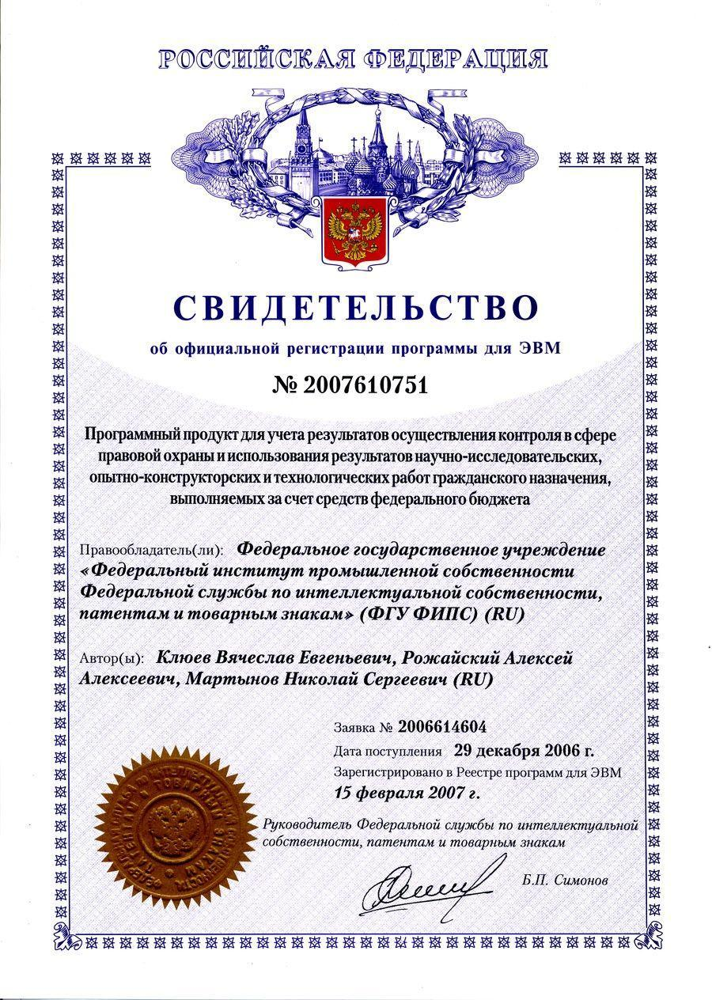

:toc: macro

= Nikolay Martynov`s personal profile

Since LinkedIn is unavailable in Russia, SkillsNet`s operator is under sanctions and it's so painful to create new career profile every time, this is now a master copy of my professional blog and career events.

toc::[]

== Blog and events

== Experience & career events

=== Hewlett Packard Enterprise
Different positions since May 2009 up to present day, more than 12 years

* Technical Lead (August 2015 - Present, more than 6 years)
+
--
Defining and implementing technology strategy in a subdivision working in the field of integration solutions for operations support systems primarily utilized by communication service providers. The goal is to make sure that business and management expectations are met by:

- Maintaining and improving teams motivation and productivity using Kaizen and WORST. Examples are use of agile development methodologies like SAFe and highly visible Kanban radiators, self-managed cross-functional teams, collective code, failure and success ownership, automatization of development processes.
- Developing or helping to develop solution and system architecture following feasibility and cost analysis in pre-sale support. This also includes design of particular application or subsystem both alone and just helping respective application architect. Results are system decomposition, more precise workload estimation, interfaces definition, selection of technologies to be applied, high level description of subsystems and algorithms to be coded, list of particular engineering tasks to be finished.
- Helping teams to resolve technological issues. Examples include suggestion of not so well-known language and tool features, alternate implementations, algorithms and tools. Sometimes an obstacle is removed by understanding and accepting a trade-off, a change in this or that characteristic of the system or part of the system.
- Developing technologically complex subsystems starting with interface definition (Javadoc); sometimes utilizing test-driven development (TDD); coding in technologies like Java, Groovy, C++, Spring, Camel, Web services, XSLT; unit testing including mocking; developing automated functional and load tests in Shell, Perl, Groovy. Target platforms are mostly Unix flavors like HP-UX and Linux.
- Troubleshooting and resolving escalated support cases both by helping support teams analyze available information and sometimes by doing remote live production system debug.
--
* Technology Consultant Expert, July 2012 - August 2015 (3 years 2 months)
+
--
* As an application architect, I'm responsible for gathering requirements from customers and business stakeholders, mixing this together with constraints at hand and coming up with the solution that could be delivered as close as possible to expectations of key stakeholders within given time frame and budget. Additionally, I'm responsible for supporting sale teams and solution architects in aspects related to my area of expertise. I specialize in mediation software for OSS domain: integrating together products from HP and other systems that customers might have. I'm also responsible for supporting delivery teams as a Java and application integration technology expert.
* As a project technical lead, I'm responsible for the technical aspects of the delivery: breakdown of requirements and large feature requests into tasks, workload estimation and planning aid, development of design and test strategy, ensuring completeness of task execution and target quality level of result, solving hard technical problems and finding workarounds for obstacles that can't be completely removed, defining engineering practices and infrastructure that should be put in place for best result. In this role I'm responsible for several versions of HP OSS Open Mediation.
* As an application developer, I work on unit tests and automated functional tests; maintain continuous integration infrastructure and build/test environment; write code, technical and user documentation; investigate defect reports and maintain products. Primary technology is Java but numerous other technologies are also essential part. These include Groovy, C++, Perl, UNIX shell (POSIX, HP-UX, Linux), XML/XSD/XSLT, Spring Framework, Apache Commons/Camel/ActiveMQ/CXF, Jenkins/Nexus.
* As a consultant, I'm responsible for delivering trainings and providing consulting services related to development of integration solutions.
* As a member of CTO and technology SPOC I'm responsible for implementing technology strategy in delivery center.
--
* Technology Consultant (May 2009 - July 2012, 3 years 3 months)
+
--
* Gathering and analysis of requirements from customers, development of solution architecture and design, workload estimation and aid in project planning, products update and creation including development of automated testing and documentation, solution delivery and customer consulting.
* Using broad range of technologies to develop solutions for Communications, Media and Entertainment industry targeting multiple hardware and software platforms.
--

=== Budgeting and Financial Technologies
* Senior developer (October 2007 - March 2009, 1 year 6 months)
+
--
* Refinement of current proprietary server platform (Java); prototyping next step server platform (Java, ejb3, JBoss); design and implementation of client platform (Rich Client Application) (Java, swing); development of business application (Java, Firebird); use cases review, estimation of time to develop.
* Developed and introduced into commercial operation system for automated control and management of municipal property.
--

=== Federal Institute of Industrial Property
* Engineer (July 2006 - October 2007, 1 year 4 months)
+
--
* Analyzing technological processes; developing software for jobs automation (Java, swing, derby); examining works performed by contractors; maintaining software and hardware systems used in technological processes; developing control and accounting system (proprietary platform).
* Developed and introduced into commercial operation software complex for jobs automation. Developed and introduced into commercial operation software for accounting results of monitoring and oversight of results of research activities.
+
[link=author-certificate-fips.jpg]

--

== Licenses & certifications & courses

== Skills

