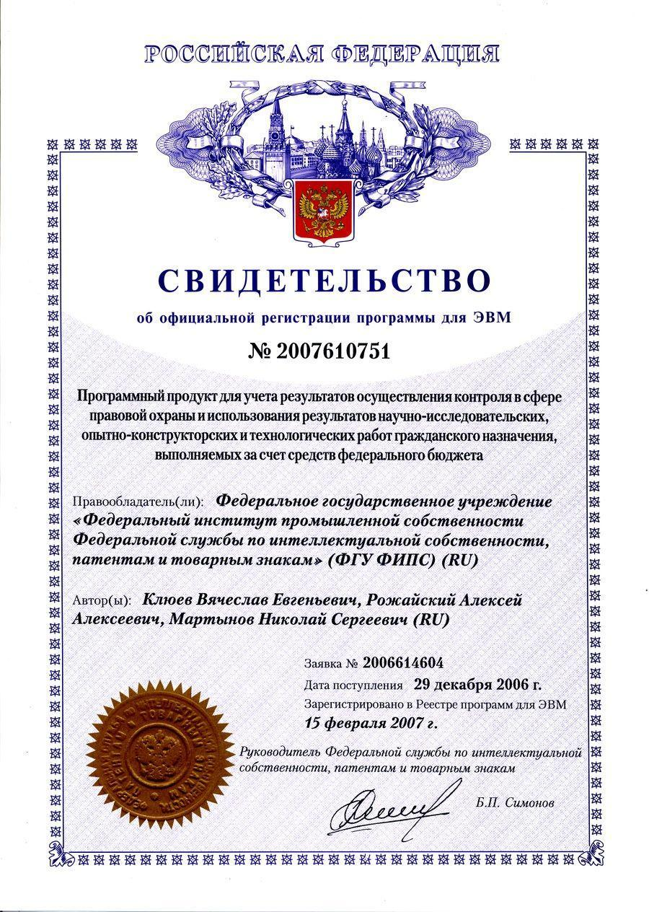

:toc: macro

= Nikolay Martynov`s personal profile

Since LinkedIn is unavailable in Russia, SkillsNet`s operator is under sanctions and it's so painful to create new career profile every time, this is now a master copy of my professional blog and career events.

toc::[]

== Articles, posts and events

* link:blog/2019-07-06-EIP-in-your-documentation.adoc[EIP in your documentation]
* link:blog/2019-06-26-Retro-style-open-source-dependencies.adoc[Retro style open source dependencies]
* link:blog/2019-06-20-Software-Architecture-Patterns.adoc[Software Architecture Patterns]
* link:blog/2019-06-12-Asserting-Log4J-2-with-Spock.adoc[Asserting Log4J 2 with Spock]
* link:blog/2019-04-20-Building-Evolutionary-Architectures.adoc[Building Evolutionary Architectures]
* link:blog/2019-04-02-Schema-for-JSON.adoc[Schema for JSON]
* link:blog/2019-03-27-Overlock.adoc[Overlock]
* link:blog/2019-03-20-Bedtime-Stories-for-Managers.adoc[Bedtime Stories for Managers]
* link:blog/2019-02-28-Architecture.adoc[Architecture?]
* link:blog/2019-02-12-5G-NR-The-Next-Generation-Wireless-Access-Technology.adoc[5G NR: The Next Generation Wireless Access Technology]
* link:blog/2017-10-15-Fall-through-a-function.adoc[Fall through a function]
* link:blog/2017-04-06-Making-Java-Groovy.adoc[Making Java Groovy]
* link:blog/2016-11-03-How-to-resume-unwinding.adoc[How to resume unwinding]
* link:blog/2016-09-06-Include-libraries-in-Groovy-scripts.adoc[Include libraries in Groovy scripts]
* link:blog/2016-09-02-Cheap-natural-language-interpreter.adoc[Cheap natural language interpreter]
* link:blog/2016-08-27-How-does-dollar-do-it.adoc[How does dollar do it?]
* link:blog/2016-01-20-Digital-Entrepreneurship-Project.adoc[Digital Entrepreneurship Project]
* link:blog/2010-08-25-What-is-difference-between-synchronized-method-and-synchronized-block.adoc[What is difference between synchronized method and synchronized block?]
* link:blog/2009-10-20-Agile-Patterns-The-Technical-Cluster.adoc[Agile Patterns: The Technical Cluster]
* link:blog/2009-04-08-Scrum-practice-Part-3-Sprint.adoc[Scrum practice. Part 3: Sprint]
* link:blog/2009-03-27-Scrum-practice-Part-2-Planning.adoc[Scrum practice. Part 2: Planning]
* link:blog/2009-03-22-Scrum-practice-Part-1-Retrospective.adoc[Scrum practice. Part 1: Retrospective]
* link:blog/2009-02-03-Utility_classes_vs_Objects.adoc[Utility classes vs Objects]

== Experience & career events

=== Hewlett Packard Enterprise
Different positions since May 2009 up to present day, more than 12 years

* Technical Lead (August 2015 - Present, more than 6 years)
+
--
Defining and implementing technology strategy in a subdivision working in the field of integration solutions for operations support systems primarily utilized by communication service providers. The goal is to make sure that business and management expectations are met by:

- Maintaining and improving teams motivation and productivity using Kaizen and WORST. Examples are use of agile development methodologies like SAFe and highly visible Kanban radiators, self-managed cross-functional teams, collective code, failure and success ownership, automatization of development processes.
- Developing or helping to develop solution and system architecture following feasibility and cost analysis in pre-sale support. This also includes design of particular application or subsystem both alone and just helping respective application architect. Results are system decomposition, more precise workload estimation, interfaces definition, selection of technologies to be applied, high level description of subsystems and algorithms to be coded, list of particular engineering tasks to be finished.
- Helping teams to resolve technological issues. Examples include suggestion of not so well-known language and tool features, alternate implementations, algorithms and tools. Sometimes an obstacle is removed by understanding and accepting a trade-off, a change in this or that characteristic of the system or part of the system.
- Developing technologically complex subsystems starting with interface definition (Javadoc); sometimes utilizing test-driven development (TDD); coding in technologies like Java, Groovy, C++, Spring, Camel, Web services, XSLT; unit testing including mocking; developing automated functional and load tests in Shell, Perl, Groovy. Target platforms are mostly Unix flavors like HP-UX and Linux.
- Troubleshooting and resolving escalated support cases both by helping support teams analyze available information and sometimes by doing remote live production system debug.
--
* Technology Consultant Expert, July 2012 - August 2015 (3 years 2 months)
+
--
* As an application architect, I'm responsible for gathering requirements from customers and business stakeholders, mixing this together with constraints at hand and coming up with the solution that could be delivered as close as possible to expectations of key stakeholders within given time frame and budget. Additionally, I'm responsible for supporting sale teams and solution architects in aspects related to my area of expertise. I specialize in mediation software for OSS domain: integrating together products from HP and other systems that customers might have. I'm also responsible for supporting delivery teams as a Java and application integration technology expert.
* As a project technical lead, I'm responsible for the technical aspects of the delivery: breakdown of requirements and large feature requests into tasks, workload estimation and planning aid, development of design and test strategy, ensuring completeness of task execution and target quality level of result, solving hard technical problems and finding workarounds for obstacles that can't be completely removed, defining engineering practices and infrastructure that should be put in place for best result. In this role I'm responsible for several versions of HP OSS Open Mediation.
* As an application developer, I work on unit tests and automated functional tests; maintain continuous integration infrastructure and build/test environment; write code, technical and user documentation; investigate defect reports and maintain products. Primary technology is Java but numerous other technologies are also essential part. These include Groovy, C++, Perl, UNIX shell (POSIX, HP-UX, Linux), XML/XSD/XSLT, Spring Framework, Apache Commons/Camel/ActiveMQ/CXF, Jenkins/Nexus.
* As a consultant, I'm responsible for delivering trainings and providing consulting services related to development of integration solutions.
* As a member of CTO and technology SPOC I'm responsible for implementing technology strategy in delivery center.
--
* Technology Consultant (May 2009 - July 2012, 3 years 3 months)
+
--
* Gathering and analysis of requirements from customers, development of solution architecture and design, workload estimation and aid in project planning, products update and creation including development of automated testing and documentation, solution delivery and customer consulting.
* Using broad range of technologies to develop solutions for Communications, Media and Entertainment industry targeting multiple hardware and software platforms.
--

=== Budgeting and Financial Technologies
* Senior developer (October 2007 - March 2009, 1 year 6 months)
+
--
* Refinement of current proprietary server platform (Java); prototyping next step server platform (Java, ejb3, JBoss); design and implementation of client platform (Rich Client Application) (Java, swing); development of business application (Java, Firebird); use cases review, estimation of time to develop.
* Developed and introduced into commercial operation system for automated control and management of municipal property.
--

=== Federal Institute of Industrial Property
* Engineer (July 2006 - October 2007, 1 year 4 months)
+
--
* Analyzing technological processes; developing software for jobs automation (Java, swing, derby); examining works performed by contractors; maintaining software and hardware systems used in technological processes; developing control and accounting system (proprietary platform).
* Developed and introduced into commercial operation software complex for jobs automation. Developed and introduced into commercial operation software for accounting results of monitoring and oversight of results of research activities.
+
[link=images/author-certificate-fips.jpg]

--

=== Intersoft Lab
* Web developer, part time (January 2005 - May 2006, 1 year 5 months)
+
--
* Improving web portal engine (python, MySQL); adapting and deploying content to websites (HTML, CSS, Bash); administrating web servers (mandriva linux, httpd, mysqld, proftpd); analyzing and preventing security threats (nvd nist/secunia, snort, tripwire); developing accompanying software (bash, python).
--

=== Ambiz Inc
* Programmer, part time (October 2004 - October 2005, 1 year 1 month)
+
--
* Developing website (php, MySQL); developing software for business process automation (bash, c++, wbat); administrating workstations (windows, gentoo linux); user support.
* Developed and introduced into commercial operation web based catalog of products. Developed and introduced into commercial operation software for recording telephone conversations with customers.
--

=== State Educational Institution School 489
* Information and computer technology teacher, part time (September 2003 - July 2004, 11 months)
+
--
* Urgently hired to substitute regular teacher that has left the school. I was responsible for teaching 8th class students the basics of computer science including computer structure and basics of microelectronics, number systems and arithmetic coding, algorithms and programming languages.
--

=== Intron Plus Ltd
* Junior Programmer, part time (September 2002 - December 2003, 1 year 4 months)
+
--
* Developing subsystem for data input, clustering and storage (c++).
--

=== Moscow Power Engineering Institute (Technical University)
* Laboratory assistant, part time (September 2001 - August 2002, 1 year)
+
--
* Developing software (c++, bash, alt linux).
* Developed and introduced into commercial operation software complex "Print server", providing control and accounting for consumption of paper and ink in multi-user environment.
--

== Awards & certifications & courses & education

* link:https://www.credly.com/badges/c5d49fdb-6bb7-45cb-96e0-e78bc0290d9a[LFD259: Kubernetes for Developers]
** February 2022
** Earners of the LFD259: Kubernetes for Developers badge can containerize, host, deploy, and configure an application in a multi-node cluster. They can also define application resources and use core primitives to build, monitor and troubleshoot scalable applications in Kubernetes using a simple Python script. These candidates have experience working with network plugins, security and cloud storage, and understand the many features needed to deploy an application in a production environment.

* link:https://www.credly.com/badges/4a7895c7-c2d3-4a1e-8487-bef0e0b42688[LFD254: Containers for Developers and Quality Assurance]
** October 2021
** Earners of the LFD254: Containers for Developers and Quality Assurance badge understand the open container ecosystem and know how to run, operate and troubleshoot containers. They build container images and use tools such as Buildah, Podman and Skopeo. They know the basics of container networking and different storage concepts. They also know how to build and deploy a microservices stack with Docker Compose and how to deploy containers in production. They are familiar with Kubernetes and Tekton.

* link:https://www.credly.com/badges/5adf08ce-8d39-41ef-832a-c3ad70db04a1[LFC191: Open Source Licensing Basics for Software Developers]
** September 2021
** Earners of the LFC191: Open Source Licensing Basics for Software Developers badge possess a good working knowledge of open source licensing and compliance. They can distinguish the different types of licenses and permissions, and are able to create file notices with copyrights and licenses.

* link:https://archiveprogram.github.com/[Arctic Code Vault Contributor]
** February 2020
** Contributed code to link:https://github.com/HewlettPackard/phased-table-translation[HewlettPackard/phased-table-translation] in the 2020 GitHub Archive Program

* Agile Project Management: P&G Certified Scrum Master
** January 2015
** Internal certification in Hewlett-Packard

* HP Application and Business Services Leading the Way Rock Star
** July 2013
** Silver winner in category "Highly capable & innovative"

* JB439: Red Hat JBoss Fuse with Red Hat JBoss A-MQ and Camel
** October 2012
** Red Hat® JBoss® Fuse Rapid Track (JB439) is a 5-day course that gives Java™ developers, architects, and Red Hat JBoss Fuse administrators an understanding of Red Hat JBoss Fuse, Red Hat JBoss A-MQ (Java Messaging Service broker), and Apache Camel.

* Sun Certified Programmer for the Java 2 Platform 1.4
** August 2007
** Prometric

* Moscow Power Engineering Institute (Technical University)
** 2000 - 2006
** Master of Engineering (M.Eng.)
** Information Technology
** Studied engineering and nondestructive testing specializing in usage of neural networks for analysis of data coming from magnetic and eddy current testers.
*** link:university/sa_rprop.pdf[Использование специальных методов обучения в нейросетевом классификаторе дефектов] (Публикация для журнала)
*** link:university/arcitecture.pdf[Использование объектно-ориентированного подхода при проектировании нейросетевого классификатора дефектов]  (Публикация для журнала)
*** Применение нейронных сетей для анализа дефектов (Магистерская диссертация)
link:university/magdip_pres.pdf[Презентация]
link:university/magdip_zapis.pdf[Пояснительная записка]
+
--
В работе производится анализ методики, позволяющей отстроиться от влияния
изменения   толщины   стенки   трубы   и   режима   намагничивания   при   проведении
классификации и определении параметров дефектов; методик автоматической настройки
нейронных   сетей;   методик,   позволяющих   улучшить   качество   обучения.
Продемонстрировано применение передовых подходов к разработке программных систем.
Рассмотрено строение программного комплекса, реализующего данные подходы и методики
для решения задачи определения класса дефекта и его параметров.
--
*** Определение типа и параметров дефектов труб нефте- и газопроводов с использованием нейронной сети типа многослойный персептрон  (Бакалаврская выпускная работа)
link:university/bakalavr_pres.pdf[Презентация]
link:university/bakalavr.pdf[Пояснительная записка]
+
--
В работе исследуется возможность и особенности применения
нейронной сети типа многослойный персептрон для определения типа
дефектов   труб   нефте-   и   газопроводов   по   вектору   признаков   и
определения   их   параметров.   Исследованы   особенности   применения
совмещенной (одна нейронная сеть) и раздельной (разные нейронные
сети   используются   для   определения   класса   и   подкласса)  схем
классификации. В работе даны рекомендации по выбору количества
скрытых слоев и нейронов в них. Исследована возможность обучения
сети на зашумленных модельных данных и данных, полученных от
тестовой   трубы.   Оценена   возможность   применения   специальных
методов  ускорения процесса  обучения  и  улучшения способности  к
обобщению, таких как алгоритмы RPROP и SARPROP, а также ранняя
остановка процесса обучения.
--
*** Применение нейронных сетей для классификации и параметризации дефектов труб парогенератора  (Курсовая работа)
link:university/kursovik_pres.pdf[Презентация]
link:university/kursovik.pdf[Пояснительная записка]
+
--
Парогенераторы являются ответственными изделиями так как являются
оборудованием,   применяемым   на   атомных   электростанциях.   Очевидно,   что
критически важно надежно выявлять дефекты трубок парогенератора. Более того,
необходимо определять характер обнаруженного дефекта, его местоположение
(внутренняя   или   внешняя   поверхность   трубки)   и   параметры.   Важнейшими
параметрами дефекта являются его глубина и ширина.
Контроль трубок парогенератора производится вихретоковым методом.
Сигнал   с  датчика  передается   в  компьютер,  где  подвергается   обработке   –
фильтрации и кластеризации. Далее вычисляются признаки дефектов:

- Амплитуда
- Фаза
- Размах
- Энергия
- другие.

Полученные   признаки   подвергаются   дальнейшей   обработке   с   целью
определения типа дефекта и его параметров:

- глубина
- ширина
- угол.

Для   этого   возможно   применение   таких   методов   как   использование
искусственных нейронных сетей и регрессионный анализ. В данной работе
исследуется  применение нейронной  сети  типа многослойный персептрон  с
обучением по алгоритму RPROP.
--

== Extra information

* My GitHub link:https://github.com/nikolay-martynov[contributions overview]
* My LinkedIn link:https://www.linkedin.com/in/nikolaymartynov/[profile]
* My Credly link:https://www.credly.com/users/nikolay-martynov[badges]
* My VK link:https://vk.com/nikolay.s.martynov[profile]
* My OK link:https://ok.ru/nikolay.s.martynov[profile]

== Skills

In order of peers recognition per LinkedIn:

* Java
* Software Development
* Process Improvement
* Design Patterns
* Unix Shell Scripting
* Team Leadership
* Linux
* Unix
* HP-UX
* Telecommunications
* C++
* Integration
* Solution Architecture
* Unit Testing
* System Testing
* Functional Testing
* Load Testing
* XML
* XSD
* XSLT
* Perl
* Kaizen
* Agile Application Development
* Scrum
* Kanban
* EIP
* System Architecture
* Software Design
* Groovy
* Swing
* POSIX
* OpenStack
* Remote Troubleshooting
* Technical Support
* Automated Software Testing
* Mock
* System Integration Testing
* Technical Hiring
* Knowledge Management
* Bash
