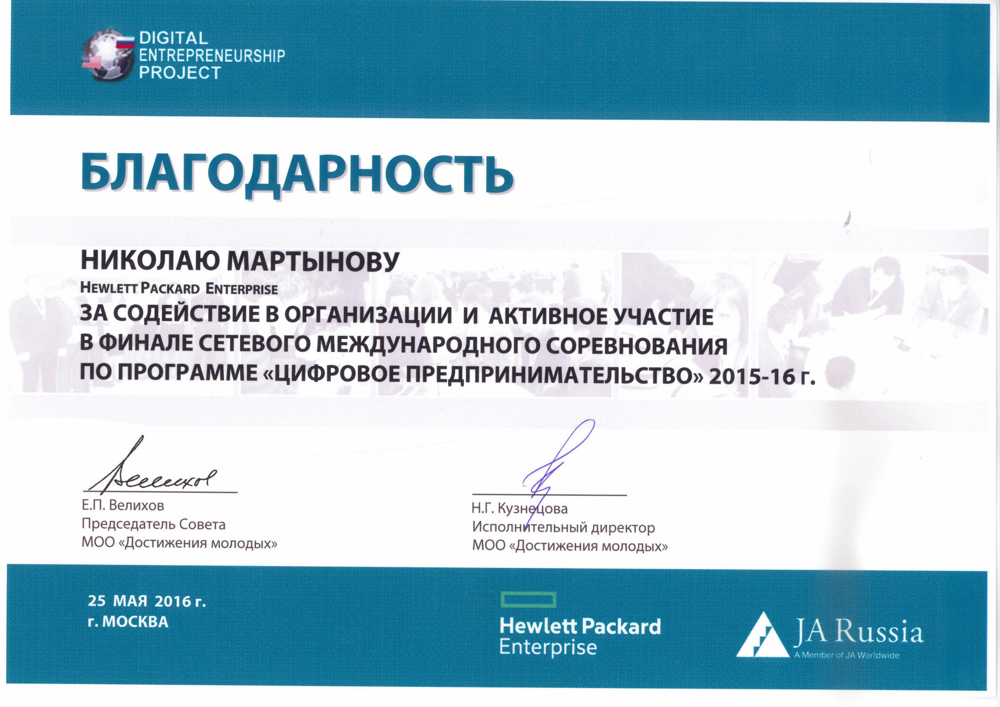

= Digital Entrepreneurship Project

_2016-01-20_

Helping young entrepreneurs to understand how software development happens from ideation to demo. Thanks to agile this topic isn't a rocket science even for 4-students teams.

Press release is link:http://digital.jastudycenter.ru/news-media/77-hpe-e-mentors-will-support-us-russia-teams-work-while-they-develop-innovative-digital-entrepreneurship-concepts[here].
