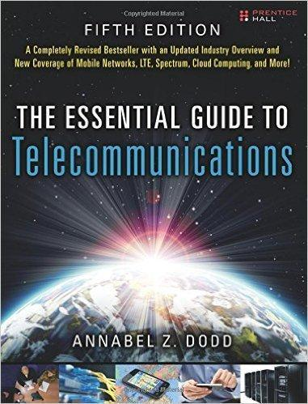

= Essential Guide to Telecommunications

_2017-01-11_

link:https://www.amazon.com/Essential-Guide-Telecommunications-Telecommu-_p5-ebook/dp/B008HHE3C4[The Essential Guide to Telecommunications 5th Edition] (Prentice Hall) by Annabel Z. Dodd.

A very nice introduction about how telcos operate. While too high level for a practical application, still useful to understand main telco concepts both from technology and from business perspectives.
