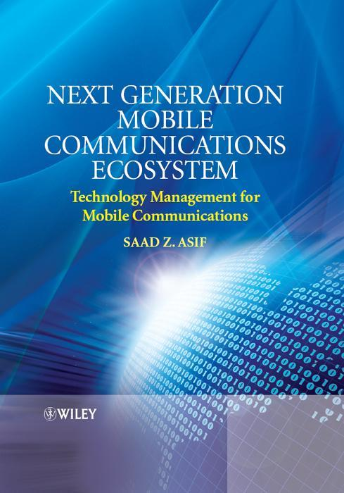

= Next Generation Mobile Communications Ecosystem: Technology Management for Mobile Communications

_2017-01-25_

Another nice reading on telco stuff. Much more technical this time. Covers really wide range of techs:

* phone internals
* radio signal modulation and coding
* backhaul
* metro
* backbone
* core and all the stuff that lives in it

link:https://www.wiley.com/en-us/Next+Generation+Mobile+Communications+Ecosystem%3A+Technology+Management+for+Mobile+Communications-p-9780470747469[Next Generation Mobile Communications Ecosystem: Technology Management for Mobile Communications] by Saad Z. Asif
