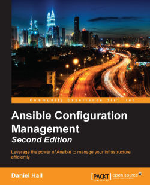

= Ansible Configuration Management

_2017-03-02_

link:https://www.packtpub.com/product/ansible-configuration-management-second-edition/9781785282300[Ansible Configuration Management, Second Edition] by Daniel Hall so far is my favorite book on ansible.

What puts this book ahead of others is that it covers practical aspects. It's not a classic cookbook and gives enough basics to understand ansible even if you haven't read anything else yes. Still at the same time it's built around practical applications and specific recipes:

* multiple tasks in handlers
* dynamic groups
* dynamic inventories
* practical aspects of roles and custom modules
