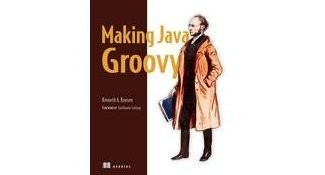

= Making Java Groovy

_2017-04-06_

link:https://www.safaribooksonline.com/library/view/making-java-groovy/9781935182948/[Making Java Groovy] by Kenneth A. Kousen is a nice reading for those who want to improve coding productivity. Of course, it's about Groovy rather than Java so hardcore purists might be insulted. However, I've seen enough examples proving that it's not Java that's slower than C and it's not a Groovy that's turtle compared to Java; examples proving that things are slow because algorithm or data structure was chosen without second thinking or was just copy-pasted from Stackoverflow. Three level deep loop is slow no matter if it's in Java or in Groovy. So it might be a nice try to free up yourself from some boilerplate code to get more time for thinking on design.

The book itself is not full of water but rather contains practical examples. There is no rocket science, secret sauce or black magic in the book so you might get nothing new from it if you were sticking in Groovy for some time already. But if you want to recap or are new to Groovy then this will save you from explanation of basic programming principles and get right to the point.

It's not boring and reads easily. Doesn't make me sleepy so ok to read at evenings.
