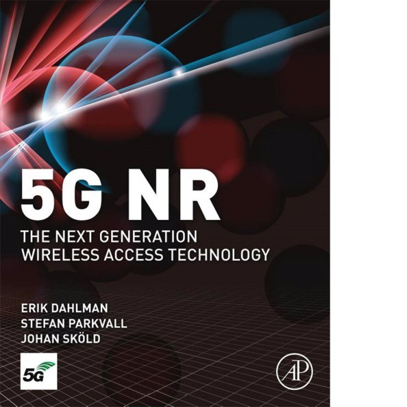

= 5G NR: The Next Generation Wireless Access Technology

_2019-02-12_

I am no radio equipment engineer but Johan Skold, Stefan Parkvall and Erik Dahlman wrote link:https://learning.oreilly.com/library/view/5g-nr-the/9780128143247/[5G NR: The Next Generation Wireless Access Technology] well enough for me to understand at least the first half. Well, maybe the first quarter was easier than the second one but the important point is that they made it quite clear why first two words in Long Term Evolution/LTE (4G) have kind of failed when it comes to Radio Access Network/RAN.

Years ago, _cloud_ was a buzz word that many engineers have used in a negative light to mock the management that gartner too much. Today, it's a reality used under the hood of lots of what we use in everyday life.

The other buzz words are the Internet Of Things/IoT and self-driving cars. Those were heard of for quite a time already but had not yet become our everyday life. *The part* of the reason for this might be the practical problems in the field of communication technologies.

The book takes a look at use cases like self driving cars, sensors, industry automation, widespread use of aerial drones. It explains what are the current difficulties that 4G presents for these use cases. Of course, the book tells what industry changes with 5G to be able to better address them. That was good to learn.

The later chapters dive deeper and deeper into coding, signalling and radio equipment characteristics. It was too much for me and I mostly just scanned through it. Unfortunately, the book tells very little of Core Network/CN. But that's understandable since NR in the title stands for New Radio. I did not know that and initially assumed that the book is about 5G in general. At least, now I know that much.

I would be looking forward for another book more focused on core network and all the cloudy tech that is closer to me. However, I would still recommend first five to seven chapters to software engineers working in telco space, at least, for the general understanding that 5G is not just another empty buzz word that managers have read on Gartner.
