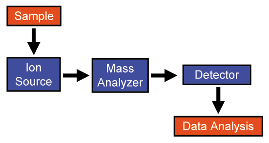

= Architecture?

Why would one need an architect when you can have a meeting to discover and decide all technical aspects by a council?

Why would you want a link:https://www.scaledagileframework.com/vision/[vision], link:https://www.scaledagileframework.com/solution-context/[context], link:https://www.scaledagileframework.com/solution-intent/[intent], link:https://www.scaledagileframework.com/story/[stories], link:https://www.scaledagileframework.com/nonfunctional-requirements/[NFRs] and link:https://www.scaledagileframework.com/model-based-systems-engineering/[models] when you can have a PowerPoint slide that describes the system perfectly?

Who would need a link:https://www.scaledagileframework.com/set-based-design/[set-based design] when a good manager can make a proper technical decision?

Why would one want to dedicate "resources" when architecture is a waste anyway?

Stop wasting your time! Silly questions don't get you closer to production. Start coding today instead.

