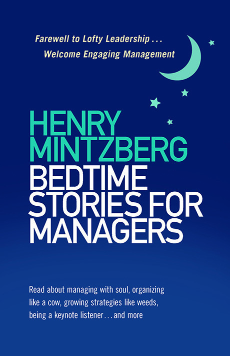

= Bedtime Stories for Managers

Previously I had a wish that everyone in the industry reads link:https://www.amazon.com/Mythical-Man-Month-Software-Engineering-Anniversary/dp/0201835959[The Mythical Man-Month: Essays on Software Engineering] by link:http://www.cs.unc.edu/~brooks/[Frederick P. Brooks]. That still holds but now I also wish that everyone then reads link:https://www.bkconnection.com/books/title/Bedtime-Stories-for-Managers[Bedtime Stories for Managers] by link:http://www.mintzberg.org/[Henry Mintzberg].

Probably not so good for a bedtime since it does not make you sleepy. But at least it returns the hope that exceptions for the link:http://catb.org/jargon/html/M/management.html[M-word] should not and have not be exceptions.
