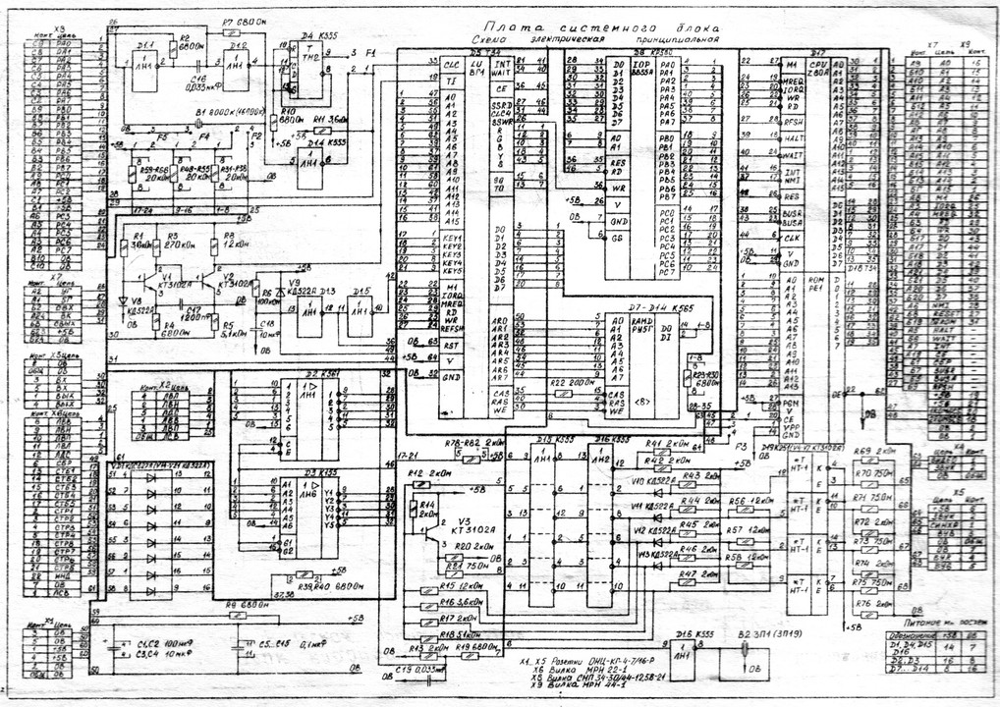

= Schema for JSON

_2019-04-02_

Telco world is dragging along the rest of IT industry and slowly adopting "newer" encodings like JSON instead of link:https://en.wikipedia.org/wiki/Abstract_Syntax_Notation_One[ASN.1] and XML. As we're approaching 5G there will be more and more of JSON and REST. Binary encodings like link:https://github.com/protocolbuffers/protobuf[Protobuf] or link:https://avro.apache.org/docs/current/[Avro] are still more efficient compared to JSON. But when we're talking about the systems developed and often maintained by different organizations it is kind of important to be able to read the data with naked eyes. JSON is already more compact than XML and JSON parsers have less to do than XML parsers so there already will be a profit.

It is clear how to describe the data structure when you are dealing with XML. Yes, that's XSD. Not quite so clear for JSON. For JSON, there are generally a number of options:

* link:https://json-schema.org/[JSON Schema]
* link:https://tools.ietf.org/html/rfc6020[YANG]
* link:https://www.openapis.org/[OpenAPI]

The choice is not obvious. For example, link:https://www.3gpp.org/[3GPP] uses all three options in their specifications:

* link:http://www.3gpp.org/ftp//Specs/archive/28_series/28.541/28541-f20.zip[TS 28.541] uses JSON Schema and YANG to define data structures
* link:http://www.3gpp.org/ftp//Specs/archive/28_series/28.532/28532-f20.zip[TS 28.532] uses OpenAPI

== JSON Schema

There is quite a number of quick and much link:https://json-schema.org/learn/file-system.html[deeper examples] and learning link:http://json-schema.org/understanding-json-schema/UnderstandingJSONSchema.pdf[tutorials]. It is also widely discussed in books:

* https://learning.oreilly.com/library/view/json-at-work/9781491982389/ch05.html
* https://learning.oreilly.com/library/view/json-quick-syntax/9781484218631/A417940_1_En_3_Chapter.html
* https://learning.oreilly.com/library/view/building-enterprise-javascript/9781788477321/008ee93b-bce6-41b2-8323-db0909c88344.xhtml
* https://learning.oreilly.com/library/view/introduction-to-javascript/9781491929476/ch04.html
* https://learning.oreilly.com/library/view/groovy-2-cookbook/9781849519366/ch06s05.html
* https://learning.oreilly.com/library/view/java-xml-and/9781484243305/html/394211_2_En_7_Chapter.xhtml

The tooling is good enough but there is a problem. All versions of JSON Schema specification are still drafts. Until a final version is released, there will be a risk that at some moment the schema will have to be adjusted to make it compatible with tools and so the data might have to be changed as well.

== YANG

YANG is defined by quite a number of specifications so it's not something too simple:

* link:https://tools.ietf.org/html/rfc6020[RFC 6020]: YANG - A Data Modeling Language for the Network Configuration Protocol (NETCONF)
* link:https://tools.ietf.org/html/rfc6110[RFC 6110]: Mapping YANG to Document Schema Definition Languages and Validating NETCONF Content
* link:https://tools.ietf.org/html/rfc6991[RFC 6991]: Common YANG Data Types [obsoletes link:https://tools.ietf.org/html/rfc6021[RFC 6021]]
* link:https://tools.ietf.org/html/rfc7950[RFC 7950]: The YANG 1.1 Data Modeling Language [replaces link:https://tools.ietf.org/html/rfc6020[RFC 6020]]
* link:https://tools.ietf.org/html/rfc7951[RFC 7951]: JSON Encoding of Data Modeled with YANG
* link:https://tools.ietf.org/html/rfc7952[RFC 7952]: Defining and Using Metadata with YANG
* link:https://tools.ietf.org/html/rfc8342[RFC 8342]: Network Management Datastore Architecture (NMDA)
* link:https://tools.ietf.org/html/rfc8525[RFC 8525]: YANG Library [obsoletes link:https://tools.ietf.org/html/rfc7895[RFC 7895]]
* link:https://tools.ietf.org/html/rfc9528[RFC 8528]: YANG Schema Mount

The problem with YANG is that there seem to be very little interest in the industry:

* The books are very scarce
* Learning resources are virtually non-existent
* Tools are very few

== OpenAPI

OpenAPI is not actually about data structure. Instead, it is about REST APIs. However, you still need to define data structures for your REST APIs and so OpenAPI has necessary capabilities. In fact, OpenAPI was derived from early version of JSON Schema and there are lots of common things concerning data structure definition.

OpenAPI has good tooling support and there are lots of books that talk about it:

* https://learning.oreilly.com/library/view/hands-on-cloud-native-microservices/9781788837866/9acd0b16-641c-40bf-9fa1-1da36be9873e.xhtml
* https://learning.oreilly.com/library/view/nestjs-a-progressive/9781939902627/ch11.html
* https://learning.oreilly.com/library/view/building-enterprise-javascript/9781788477321/0d951e1b-81b4-4e56-bcfe-2740b83351ca.xhtml
* https://learning.oreilly.com/library/view/restful-java-web/9781788294041/5f8c0ad8-5522-4c5f-be9d-d99f268e92a0.xhtml
* https://learning.oreilly.com/library/view/building-large-scale-web/9781789959567/0765657b-90c8-4541-8a1c-5ce8ada2973c.xhtml

However, OpenAPI is still about API rather than about data. While there are ways to circumvent the limitations, link:https://github.com/OAI/OpenAPI-Specification/issues/1045[specification authors do not like the idea and reject proposals to remove them]. Of course, one still can use workarounds. But will the tooling support be still good?
JSON Schema Gradle plugin

If you use JSON Schema to define a structure of data exchanged between two systems in JSON format then you often want to create a number of samples to be both used as reference examples and to verify the schema itself. The link:https://github.com/nikolay-martynov/json-validator-gradle-plugin[new] plugin allows to integrate JSON samples verification using schema into a build process if you use Gradle.
