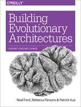
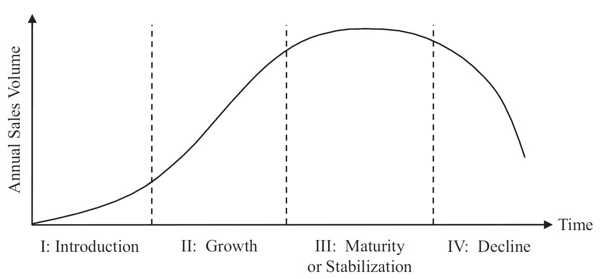

= Building Evolutionary Architectures

_2019-04-20_

ThoughtWorks was always kind of influencer for me. Their opinions had kind of weight to it. The more of disappointment it is with link:https://learning.oreilly.com/library/view/building-evolutionary-architectures/9781491986356/[Building Evolutionary Architectures] by Neal Ford, Rebecca Parsons, and Patrick Kua. I wouldn't like to question their experience and expertise. I would like to think that if you're good at something then it does not yet mean you're good at everything else. Like writing books.

First part of book looks more like an academia research rather than experience description from seasoned practitioners. I don't know. Maybe they really sit and think on these fitness functions to measure how good their architecture is and to ensure it never degrades. But, honestly, this reads like a tell-tale or a wishful thinking rather than something they actually do.

A unit test that verifies that one package does not use another. Seriously? This is what architects should spend time on? Any real world system that would require architect involvement would contain dozens of packages. Those would not be flat. There will be a tree of packages. An architect really expected to write a set of unit tests verifying which packages use what and which packages do not use specific parts of the tree? Doesn't an architect have something better to do?

An architect sets target for cyclomatic complexity to ensure that coders maintain quality specified by architecture. Really? Just stick to defaults of standard Maven/Gradle plugins for static code analysis unless corporate policy demands to use specific set of rules. It is just a common sense. What does it have to do with architecture? Cyclomatic complexity is just 1 out of 100 rules to check code against. Don't I, as an architect, have more important things to do than deciding what should be maximum value of cyclomatic complexity for this given architecture? I could understand would they talk about an architect making a compromise for code quality based on short projected life span of a product. Like if this is a throwaway experiment, a demo or something. Then there could be a strategic decision to disregard code readability, maintainability and collective ownership. But no. They're talking about an architect deciding what should be target cyclomatic complexity to ensure good quality of the code so architecture is maintained. This does not look serious to me.

link:https://en.wikipedia.org/wiki/Commercial_off-the-shelf[COTS] is bad. Vendor lock-in is bad. Using open source is bad. Everyone should develop their own software. Yeah, right. Are you guys link:https://www.thoughtworks.com/services[working in consulting] or something?

link:https://en.wikipedia.org/wiki/Freemium[Freemium] is bad for architecture, so you should not do it. Is that a joke? Try to explain this to marketing and product management who defines a business strategy that this is bad for your architecture. Aren't we, architects, here to bridge vision of business people with reality through realization of technical aspects? I do not like sales people telling me which encoding I should use for transport on wire. That's because I might know thing or two more about space or time efficiency, about interoperability, about extensibility, about troubleshooting-ability and so on. But why should I dictate business people what's a better way to sell things? I could tell "this will take more time than that" so based on current business conditions and arrangements with customers business people might make better decisions. But demand a change of business model because it is bad for architecture? Am I reading this correctly?

Developers should not do research like search for best practices, assess what's a set of tools commonly used in the industry for a particular problem and so on. That's long. That's waste. That creates attachment. Instead, just go code it. I guess unspoken is: if you don't know what to code or how to code it then just ask us. I do not like or trust link:https://stackoverflow.com/[stackoverflow] too. But, instead of inventing a square wheel that will be barely usable, isn't it better to at least check how people already tried to solve this problem? Which solutions were successful and which were not? Wouldn't it save time at the end? Wouldn't it save time in the beginning too? Isn't it why we have conferences? Isn't it why we read link:https://en.wikipedia.org/wiki/Design_Patterns[GOF] and link:https://en.wikipedia.org/wiki/Enterprise_Integration_Patterns[EIP]? Isn't it why we read this very book? To learn from experience of others about what's working and what's not and in which conditions. No?

You should treat projects like products. That's because products live forever. That's a quote. And quite news! So there are no stages in link:https://en.wikipedia.org/wiki/Product_life-cycle_management_(marketing)[product life cycle]. And both business and technical requirements do not change when product ages through its phases.

But ok, lets assume products live forever and nothing changes about them. Why should I treat projects like products and what does it really mean in practice? Cross-functional team and owner. Yeah, right. Project can't have it. No way. Thank you very much for very valuable suggestion about how to build evolutionary architecture.

Teams should be small. Ok, maybe. But I do not understand the argument: "It’s not the number of people but the number of connections they must maintain... when the number of people on a team reaches 20, they must manage 190 links" Who? Each individual team member must track connections between every pair of other members? Or manager? Or, maybe, architect should do this? Ships, planes and buildings are designed and built by teams of hundreds and thousands. Either ships, planes and buildings are all fairy tales or they manage it somehow. It's a questionable recipe and I'm not quite sure what it has to do about architecture.

"Many companies have made cycle time a first-class business metric, mostly because they live in a highly competitive market." We can talk about waterfall, scrum, kanban and lean. But what does it have to do with architecture?

I have expected a catalog of patterns proven by their experience to be useful for building evolutionary architectures. But what I have read had left a taste of advertising booklet for their consulting services. Consider something else to read instead.
