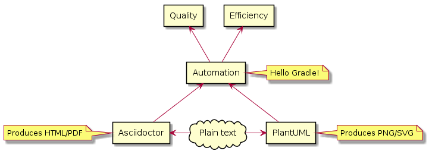
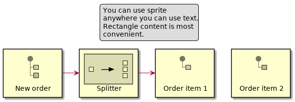

= EIP in your documentation

_2019-07-06_

It's no secret that MS Word and MS Visio are not appropriate tools for writing and maintaining documentation. Be it project documentation, technical design documentation or even user documentation. Often you even want to generate documentation and automatically keep it in sync with the product instead of manually maintaining it. That's why we have link:https://asciidoctor.org/[Asciidoctor], right?

What about diagrams and pictures? It was always a pain with myriad of diagram editors starting from link:https://wiki.gnome.org/Apps/Dia[dia] up to link:https://www.draw.io/[draw.io]. It's not editors that are bad but the fact that you need to switch from one application to another to adjust something in diagram. Then you also need to keep synchronized links from main text to diagram files. Of course, link:https://en.wikipedia.org/wiki/Object_Linking_and_Embedding[OLE] helps but this brings you back to MS Word and MS Visio that are often not well suited for the job. That's especially true if you need to generate diagram from some data source or your have a project template and need to slightly customize text in diagram for a particular project. That's where link:http://plantuml.com/[PlantUML] is great.

Asciidoctor has an integration with PlantUML and you don't need to switch tools. You just write your document with diagrams embedded into the main text. Asciidoctor then renders final result using the backend of your choice. Since Asciidoctor and PlantUML are just text, you can programmatically generate text of documentation, tables and diagrams. You can have your build tool inject project properties into text, tables and diagrams automatically during build as with any other text resource file. Of course, you can also use just PlantUML with Gradle plugin to generate  SVG or PNG to be displayed on web or anywhere else without ever touching Asciidoctor. But they really go well along.

PlantUML comes with a link:http://plantuml.com/stdlib[standard library] of components that contain stencils for AWS, Azure, Office, etc. Working a lot on integration projects I missed stencils link:https://www.enterpriseintegrationpatterns.com/patterns/messaging/index.html[Enterprise Integration Patterns]. Luckily, it's quite easy to create your own library, which I did.

The following is an example of diagram using the EIP stencil library:

[source]
--
@startuml
!includeurl https://raw.githubusercontent.com/nikolay-martynov/eip-for-plantuml/master/dist/eip-for-plantuml.puml
legend top
    You can use sprite
    anywhere you can use text.
    Rectangle content is most
    convenient.
endlegend
rectangle "<$EIP_MessageDouble>\nNew order" as newOrder
rectangle "<$EIP_Splitter>\nSplitter" as splitter
rectangle "<$EIP_MessageSingleGreen>\nOrder item 1" as item1
rectangle "<$EIP_MessageSingleOrange>\nOrder item 2" as item2
newOrder -> splitter
splitter -> item1
item1 -[hidden] item2

@enduml
--

It renders like the following:

You can play with the diagram using PlantUML link:https://www.plantuml.com/plantuml/uml/XP51IyD048Nl-HLZyPg4zYXIUb34WrRiILHacnsJnStiCZlRc7zlDerLAT8SminxVFCUx2g8OecjpSuCLJPgZ6oX4V7XeYnPTKLjf8dR690hHu8aHUNQaio7iwhFMyNIazkLQ7p-xZZtLb6wLxOg27AfJP0Zi_0fqMADf46Sps3udbo4IX4CKH0y6y5HLjHt3J92_yiN_9HYj1-n4aMrHPZgWGdGkY39JTeEoQJM6PBU9sPyO6QNvzUt3szt68AgySh5hSNb2zrZ1uuryWnK0C9kdPPZRkEj4K4UaFqu4M5Q_atQc2JUC28Dx7WTZ60Byv5Fu_m4lER1mx_qua0lik_Ma2z_-an34gUGyG_vSsEqHdgTu6o5fDCRVG40[online demo server].

You can find source for stencil library as well as full catalog of stencils on its home page on GitHub: link:https://github.com/nikolay-martynov/eip-for-plantuml[https://github.com/nikolay-martynov/eip-for-plantuml]
