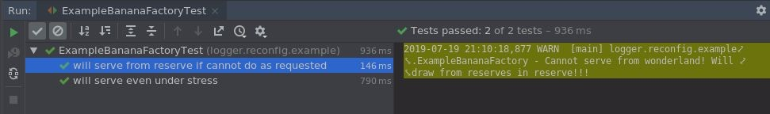

= Adjusting log level for specific feature test

_2019-07-19_

Sometimes you have a class with a rare life-cycle logging on info level and even rarer logging on warn or error levels, but suddenly you're overwhelmed with a spam stream from this class. This can easily happen when the class is quite important and should work in a multi-threaded environment in a parallel or thread-safe manner and you unit test it for this behavior. What's rare in normal conditions could easily become spam under stress test conditions.

Luckily, it's easy to have a separate test-only configuration in Log4J: just put `log4j2-test.properties` in `src/test/resources`. In test-only configuration you can mute the class. Unfortunately, this has negative consequences:

* All invocations of the class will be muted. You probably have not only test methods that probe the class under stress but also normal feature tests. These will be muted too and this could make troubleshooting such tests very hard. Also, your integration tests will not produce log records from the class as well. Troubleshooting of these tests will be harder as well. Finally, if logging is part of the contract for the class then you might be unable to link:https://www.linkedin.com/pulse/asserting-log4j-2-spock-nikolay-martynov/[test it] if class gets muted via log4j2-test.properties.
* Entropy will increase. The approach is not really tidy. You'll have to put such class names in seemingly irrelevant place. Other people will start to wonder why that thing is there. Synchronization might break if someone starts refactoring. People might become frightened to refactor due to all the fragility. You usually don't want this.

The alternative is to re-configure Log4J dynamically in particular feature test.

Let's see this on an link:https://github.com/nikolay-martynov/logger-reconfig-example[example]. Imagine we have link:https://github.com/nikolay-martynov/logger-reconfig-example/blob/master/src/main/groovy/logger/reconfig/example/ExampleBananaFactory.groovy[implementation ]of a link:https://github.com/nikolay-martynov/logger-reconfig-example/blob/master/src/main/groovy/logger/reconfig/example/BananaFactory.groovy[factory ]that logs in certain link:https://github.com/nikolay-martynov/logger-reconfig-example/blob/73a765353f8087a93133af3041df04128e2fb32f/src/main/groovy/logger/reconfig/example/ExampleBananaFactory.groovy#L48[rare conditions] deemed dangerous. Like, when class client requests a banana from specific country of origin but we cannot fulfill the request precisely and try to work in "best effort" mode serving from reserves. There might be better way to design such an API but this is just an example when we log in rare cases:

[source,groovy]
--
@Override
Banana getBananaFrom(String origin) {
    Tuple2<Boolean, AtomicLong> requestedInfo = storage[origin]
    while (true) {
        long availableFromRequested = requestedInfo?.second?.get() ?: 0
        if (availableFromRequested > 0) {
            if (requestedInfo.second.compareAndSet(
                    availableFromRequested,
                    availableFromRequested - 1)) {
                return new ExampleBanana(requestedInfo.first)
            }
        } else {
            log.warn("Cannot serve from $origin!" +
                    " Will draw from reserves in $reserveOrigin!!!")
            Tuple2<Boolean, AtomicLong> reserveInfo = storage[reserveOrigin]
            while (true) {
                long availableFromReserve = reserveInfo?.second?.get() ?: 0
                if (availableFromReserve > 0) {
                    if (reserveInfo.second.compareAndSet(
                            availableFromReserve,
                            availableFromReserve - 1)) {
                        return new ExampleBanana(reserveInfo.first)
                    }
                } else {
                    throw new IllegalStateException(
                            'Nah! This could never happen!')
                }
            }
        }
    }

}
--

Notice this `log.warn()` in else block. It is expected to be rare. Now, let's see link:https://github.com/nikolay-martynov/logger-reconfig-example/blob/without-log-control/src/test/groovy/logger/reconfig/example/ExampleBananaFactoryTest.groovy[an example of a test] for the class. Here we have a usual feature test:

[source,groovy]
--
def "will serve from reserve if cannot do as requested"() {
    given: "only reserve is available"
    ExampleBananaFactory factory = new ExampleBananaFactory(
            ["reserve": [true, 1] as Tuple2], "reserve")
    when: "have no bananas from requested origin"
    Banana result = factory.getBananaFrom("wonderland")
    then: "still gets a banana"
    result.tasty

}
--

It's quite desirable to see in test log that the class has reacted to potentially dangerous situation and informed us about it:

[source,console]
--
> Task :test
2019-07-19 20:08:35,594 WARN  [Test worker] logger.reconfig.example.ExampleBananaFactory - Cannot serve from wonderland! Will draw from reserves in reserve!!!

BUILD SUCCESSFUL in 1s
--

This might even be a part of a contract and you might link:https://www.linkedin.com/pulse/asserting-log4j-2-spock-nikolay-martynov/[test] it as well. Maybe you even use link:https://logging.apache.org/log4j/2.x/manual/appenders.html#FlumeAppender[Flume], link:https://logging.apache.org/log4j/2.x/manual/appenders.html#KafkaAppender[Kafka] or link:https://logging.apache.org/log4j/2.x/manual/appenders.html#CassandraAppender[Cassandra] appenders to get some analytics on this "best effort" behavior later.

Now, since getting bananas is of utmost importance and there will be many clients demanding them in parallel, you have a kind of stress test to check how broken code is when called from multiple threads:

[source,groovy]
--
def "will serve even under stress"() {
    given: "few good bananas and lots of bad ones in storage"
    Map<String, Tuple2<Boolean, Long>> storage =
            ["Ecuador": [true, 10000] as Tuple2,
             "Norway" : [false, 1000000] as Tuple2]
    ExampleBananaFactory factory = new ExampleBananaFactory(
            storage, "Norway")
    and: "high demand for good bananas including missing country of origin"
    Map<String, Long> demand = ["Ecuador": 1000000,
                                "Brazil" : 10000]
    and: "lots of requests going in parallel"
    AtomicLong good = new AtomicLong()
    AtomicLong bad = new AtomicLong()
    List<Thread> clients = demand.collectMany { origin, count ->
        (0..<10).collect {
            new Thread({
                (0..<count / 10).each {
                    Banana result = factory.getBananaFrom(origin)
                    (result.tasty ? good : bad).incrementAndGet()
                }
            })
        }
    }
    when: "all clients are served"
    clients*.start()
    clients*.join()
    then: "number of served good and bad bananas match what we had in store"
    good.get() == storage["Ecuador"].second
    bad.get() == storage["Norway"].second
}
--

The problem is that the test really puts class to stress and what's rare starts to happen a millions times while the test runs. Remember we logged a warning when serving bananas in "best effort" mode? A million log records. If you're lucky then the test will just run longer. If you are not then you're IDE might get stuck in garbage collection or Gradle might tell you something like the following:

[source,console]
--
Expiring Daemon because JVM heap space is exhausted
--

If we mute the whole class via `log4j2-test.properties` then we'll see no log records from feature test "will serve from reserve if cannot do as requested". That's too much to sacrifice if you wouldn't be able to see that your banana is from reserve rather than from wonderland as you have requested. Fortunately, this sacrifice is not necessary thanks to link:https://logging.apache.org/log4j/2.x/manual/customconfig.html#AddingToCurrent[an example] in Log4J documentation. Here's how we can put this to good use:

[source,groovy]
--
and: "warnings are suppressed to avoid log spam"
LoggerContext loggerContext = LogManager.getContext(false) as LoggerContext
loggerContext.configuration.addLogger(
        ExampleBananaFactory.name,
        LoggerConfig.createLogger(
                true,
                Level.ERROR,
                ExampleBananaFactory.name,
                "false",
                loggerContext.configuration.appenders.collect {
                    AppenderRef.createAppenderRef(
                            it.key,
                            null,
                            null)
                } as AppenderRef[],
                null,
                loggerContext.configuration,
                null))

loggerContext.updateLoggers()
--

Notice the cast in the beginning. There are two things with name `LoggerContext`. One is class and another is interface. They're in different packages and different JAR files. We need to cast to class from `org.apache.logging.log4j.core` that is in link:https://mvnrepository.com/artifact/org.apache.logging.log4j/log4j-core[log4j-core]. And if you're using link:http://docs.groovy-lang.org/latest/html/gapi/groovy/util/logging/Log4j2.html[@Log4j2] then you should already have log4j-core JAR in dependencies since the annotation does not work without it anyway. After this, we can add a logger for the class under test with whatever log level we want (`Level.ERROR` in this case) using link:https://logging.apache.org/log4j/2.x/log4j-core/apidocs/org/apache/logging/log4j/core/config/Configuration.html#addLogger-java.lang.String-org.apache.logging.log4j.core.config.LoggerConfig-[addLogger()] and link:https://logging.apache.org/log4j/2.x/log4j-core/apidocs/org/apache/logging/log4j/core/config/LoggerConfig.html#createLogger-boolean-org.apache.logging.log4j.Level-java.lang.String-java.lang.String-org.apache.logging.log4j.core.config.AppenderRef:A-org.apache.logging.log4j.core.config.Property:A-org.apache.logging.log4j.core.config.Configuration-org.apache.logging.log4j.core.Filter-[createLogger()]. We have to specify appenders for our new logger but we can take them right from `loggerContext.configuration.appenders`.

The same way we can restore things to initial state once feature test ends:

[source,groovy]
--
cleanup:
loggerContext.configuration.removeLogger(ExampleBananaFactory.name)

loggerContext.updateLoggers()
--

Now, neither Gradle, nor IDE have any issues with the test:

[source,console]
--
> Task :test

BUILD SUCCESSFUL in 2s
--

At the same time, we still get logging from the other feature test:<

Here's the full example of feature test with log control in it:

[source,groovy]
--
import org.apache.logging.log4j.Level
import org.apache.logging.log4j.LogManager
import org.apache.logging.log4j.core.LoggerContext
import org.apache.logging.log4j.core.config.AppenderRef
import org.apache.logging.log4j.core.config.LoggerConfig
...
def "will serve even under stress"() {
    given: "few good bananas and lots of bad ones in storage"
    Map<String, Tuple2<Boolean, Long>> storage =
            ["Ecuador": [true, 10000] as Tuple2,
             "Norway" : [false, 1000000] as Tuple2]
    ExampleBananaFactory factory = new ExampleBananaFactory(
            storage, "Norway")
    and: "high demand for good bananas including missing country of origin"
    Map<String, Long> demand = ["Ecuador": 1000000,
                                "Brazil" : 10000]
    and: "lots of requests going in parallel"
    AtomicLong good = new AtomicLong()
    AtomicLong bad = new AtomicLong()
    List<Thread> clients = demand.collectMany { origin, count ->
        (0..<10).collect {
            new Thread({
                (0..<count / 10).each {
                    Banana result = factory.getBananaFrom(origin)
                    (result.tasty ? good : bad).incrementAndGet()
                }
            })
        }
    }
    and: "warnings are suppressed to avoid log spam"
    LoggerContext loggerContext = LogManager.getContext(false) as LoggerContext
    loggerContext.configuration.addLogger(
            ExampleBananaFactory.name,
            LoggerConfig.createLogger(
                    true,
                    Level.ERROR,
                    ExampleBananaFactory.name,
                    "false",
                    loggerContext.configuration.appenders.collect {
                        AppenderRef.createAppenderRef(
                                it.key,
                                null,
                                null)
                    } as AppenderRef[],
                    null,
                    loggerContext.configuration,
                    null))
    loggerContext.updateLoggers()
    when: "all clients are served"
    clients*.start()
    clients*.join()
    then: "number of served good and bad bananas match what we had in store"
    good.get() == storage["Ecuador"].second
    bad.get() == storage["Norway"].second
    cleanup:
    loggerContext.configuration.removeLogger(ExampleBananaFactory.name)
    loggerContext.updateLoggers()

}
--

Hope it helps. You can see whole project on GitHub to get more insight into banana factories: link:https://github.com/nikolay-martynov/logger-reconfig-example[https://github.com/nikolay-martynov/logger-reconfig-example]
