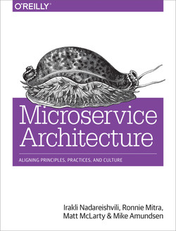

= Microservice Architecture

_2019-07-23_

There is not much I can disagree with Mike Amundsen, Matt McLarty, Ronnie Mitra and Irakli Nadareishvili. Their book "link:https://learning.oreilly.com/library/view/microservice-architecture/9781491956328/[Microservice Architecture]" does not throw a lot of lies at you and there is not much to argue with. How can one argue with poetry?

If you're up to dig a history or philosophies and motivation behind microservices then you might be interested. If you're desperately in a need of a song to help you sell a buzz word to your management then you'll find it here.

If you're a practitioner and looking for a recipe or experience or anything like that then don't waste your time and read something else.
