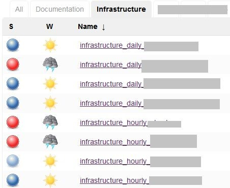
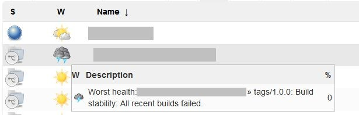
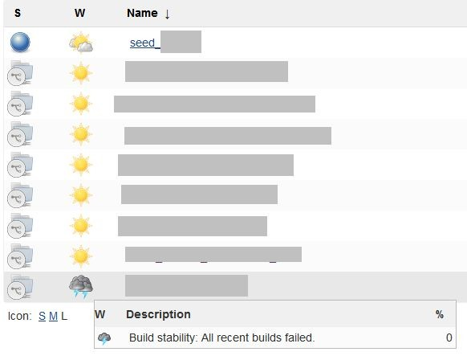

= Information radiator for multi branch pipelines via JobDSL in Jenkins

_2019-09-06_

With classic jobs when you come to job list view in Jenkins, you immediately see what's happening by the status and weather icons. This gives you idea what's working, what has to be fixed and what might be not quite stable because either people are working on it or the problem is tricky.

However, days of free style and other classic jobs are long passed. At least for building software projects. That's, obviously, because:

* You want you see status of your tags and branches
* You want to be able to have possibility to adjust build process between different versions
* You want to version and reliably store build process definition (that is closely related to sources themselves)
* You want to be able to mass-create and mass-adjust job definitions

That's why multi branch pipelines defined via JobDSL are often a natural choice. However, you won't be able to see job status by default when you go to job list view. The problem is that Jenkins will display static icon representing job type (multi branch) instead of status icon and weather, by default, will be calculated from the worst child. This could be anything like some ancient tag that cannot be built anymore because of outdated dependency or something. Or it could be some experimental feature branch where someone just makes an experiment. That's not really helpful to see status of such tag/branch on a radiator.

Unfortunately, JobDSL does not offer a straightforward way to configure job to use weather from trunk/master. Fortunately, JobDSL still offers low-level tools allowing to hack job's XML configuration however we like.

So first, we'll need to check what's default job's XML. For this we can access it via API:

. Go to job page
. Scroll to bottom of the page
. Click "REST API" link
. On the opened page find "Fetch/Update config.xml" section and click "this url" link

That's the job's definition and we'll need to replace `healthMetrics` element:

[source,xml]
--
    <healthMetrics>
        <com.cloudbees.hudson.plugins.folder.health.WorstChildHealthMetric plugin="cloudbees-folder@6.9">
            <nonRecursive>false</nonRecursive>
        </com.cloudbees.hudson.plugins.folder.health.WorstChildHealthMetric>
    </healthMetrics>
--

To see what it should be replaced with, you can play with job's settings via UI and then check job's XML definition again:

[source,xml]
--
    <healthMetrics>
        <jenkins.branch.PrimaryBranchHealthMetric/>
    </healthMetrics>
--

Ok, now it's time to generate proper job definition using JobDSL:

[source,groovy]
--
multibranchPipelineJob('my-job') {
    triggers {
        ...
    }
    branchSources {
        ...
    }
    configure {
        def metrics = it / healthMetrics
        metrics.children().clear()
        metrics << 'jenkins.branch.PrimaryBranchHealthMetric' {
        }
    }
}
--

This `configure` block directly manipulates job's XML. `it` (parameter of closure passed to `configure`) is a link:http://docs.groovy-lang.org/latest/html/api/groovy/util/NodeList.html[NodeList] so you can use its API to navigate and manipulate the XML. In this case, we're replacing default 'worst child' with 'primary branch'.

The radiator will now display Subversion's trunk and Git's master status:

Now we can immediately see what requires our attention.
