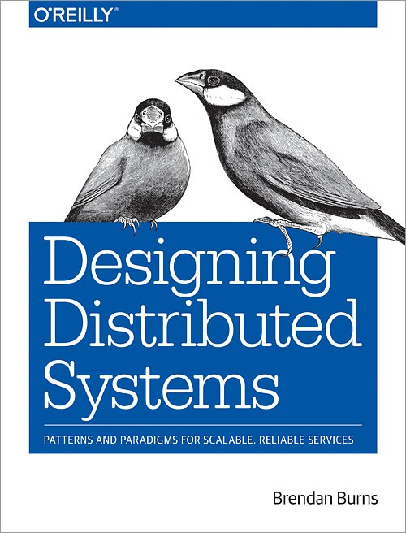

= Designing Distributed Systems

_2019-10-02_

link:https://learning.oreilly.com/library/view/designing-distributed-systems/9781491983638/[A book] by Brendan Burns. Two concerns before I praise it:

* Pattern catalogs are essential to establish a common language. And it’s really important to talk the same language to be able to understand each other. There is link:https://en.wikipedia.org/wiki/Design_Patterns[GoF] for design patterns and there is link:https://en.wikipedia.org/wiki/Enterprise_Integration_Patterns[EIP] for integration patterns. If a pattern exists then it’s best to refer to it by its established name rather than introduce a new one. And when a new name for an old pattern is already occupied by another pattern then it’s an invitation for disaster. Imagine that an architect has recommended to a developer to use a particular pattern. But then developer takes a book and finds a completely different description by that name. Because of this issue, I would strongly recommend Designing Distributed Systems to be preceded by EIP in a reading list.
* A second concern is that, unlike beginning, the ending of the book lacks implementation examples. Or at least explanation or detailed description of such implementations. It’s nice to be informed about general direction. But a practical example could be much more useful. Feels like the author was in a hurry to finish the book.

But, as said, I actually like the book and will likely *use* it. And I mean *use* like you *use* GoF and you *use* EIP to remind yourself with a recipe for a particular situation:

* How you could do it?
* What are the risks and limitations?
* What’s too keep in mind?

So, yes, _Designing Distributed Systems_ is yet another pattern catalog. This time it’s about patterns for building distributed systems. What’s refreshing is that it’s about *modern* distributed systems and not something you did 30 years ago. As Craig Walls says in his link:https://learning.oreilly.com/library/view/spring-in-action/9781617294945/[Spring in Action, Fifth Edition]: “_The way we develop applications today is different than it was a year ago, 5 years ago, 10 years ago, and certainly 15 years ago_”. So right from the beginning the first three patterns are about solving practical problems using containers and Kubernetes:

* Sidecar
* Ambassadors
* Adapters

The second chapter is about general problems of distributed systems but assumes that the system has a modern architecture. And yes, it’s again mostly uses containers to solve the problem and illustrates it with Kubernetes:

* Replicated Load-Balanced Services
* Sharded Services
* Scatter/Gather
* Functions and Event-Driven Processing
* Ownership Election

The last chapter somewhat lacks in details and taxonomy is not completely clear. However, it’s still something to keep in mind:

* Work Queue, Source Container, Worker Container, Multi-Worker
* Copier, Filter, Splitter (this is router in EIP), Sharder, Merger (I would say this is aggregator in EIP), Publisher/Subscriber - these are not exactly the same patterns you have in EIP. These are more about work rather than message exchange. And when you’re talking about work, that is likely long, rather than about message, which processing is likely quick, then it starts to make sense that these subtle differences between EIP and work patterns are in place.
* Join, Reduce - well, I would say these are just specific cases of aggregation. But ok, examples are always nice to have. However, there are less and less details closer to the book ending.

Generally, I would very much recommend reading it. Worth the time. Personally, I think it's on my use-list now.
