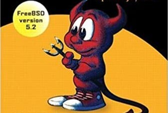

= The Design and Implementation of the FreeBSD Operating System

_2020-07-31_

This was long time overdue but it's better to be late than never. link:https://www.amazon.com/Design-Implementation-FreeBSD-Operating-System/dp/0201702452[This book] by Marshall Kirk McKusick and George V. Neville-Neil was there in my library from the days when I've finished university. And it has dusted there since I've never had an opportunity to work with FreeBSD or any other BSD as part of my job and had to spend a lot of time studying cryptography and a lot of other stuff which I've actually needed for my daily work. Now with all the COVID-19 story it is an opportunity to revisit what you wanted but never had a time for.

The book has very much reminded me of link:https://books.google.ru/books/about/%D0%A1%D0%B5%D1%82%D0%B5%D0%B2%D1%8B%D0%B5_%D0%BE%D0%BF%D0%B5%D1%80%D0%B0%D1%86%D0%B8%D0%BE%D0%BD%D0%BD%D1%8B%D0%B5.html?id=lQ2fOwAACAAJ&source=kp_book_description&redir_esc=y[operating systems textbook] I had to study in the University. The FreeBSD book and the textbook I had are very similar and are very different at the same time. In fact, I have very much hated this network operating systems textbook. By the time I had to take that operating systems course, I knew enough to understand that a lot of what was in the textbook is not exactly correct or is just plainly incorrect. The textbook tried to dumb down many concepts and was largely confusing for those who did not know the truth. That's the difference. The similarity is that both books touch very broad spectrum of topics.

You may say that something that old is irrelevant today. Especially, that it's some yet another OS no one cares about. But being old does not make all the structures and algorithms, described by link:https://en.wikipedia.org/wiki/Donald_Knuth[Knuth], outdated. We're still using all of these today. Maybe not by coding them in assembler ourselves but they're still there in core libraries we use every day. Understanding or not understanding differences in time and space complexity of linked list, tree and associative map implementations could make a difference between a nimble, performant and scalable system and a monster that processes data at a snail pace. If a language makes it easy for you not to care what is under the hood then this still does not mean that modern software written by modern coder should require 6 VMs with 8 CPUs to do less than an old software on single core server. If you know structures and algorithms, you can use modern tools to create software that is as efficient as before but you would spend much less time. The same is for link:https://en.wikipedia.org/wiki/Design_Patterns[GoF] and design patterns. They might be ancient but don't you still use a strategy or a decorator here and there?

The same is with FreeBSD 5.2 which the book is about. It's UNIX. It's POSIX. A lot of things are the same in Mac OS X and Linux. A lot of things are probably implemented the same in Windows (starting from NT, of course). A lot of things have evolved from since FreeBSD 5.2. But you're still plugging PC into AC outlet in a wall the same way it was done for decades. Basic implementation of a lot of things is still the same if you ignore user interface for a moment.

So yes, it's old and it's a fancy name you don't hear every day. But all these subsystems are still implemented largely the same in every modern OS you use every day. Which subsystems? You'll find in The Design and Implementation of the FreeBSD Operating System description of the implementation for the following:

* Memory allocation, control and protection both within the kernel and for the processes including both physical and virtual memory
* Time sharing, scheduling and control of processes and threads and the resources allocated to them, tools for processes to communicate and synchronize
* Interaction with external devices starting from drivers up to application level interface, from physical file system implementation up to NFS client interface
* Networking subsystem including details of TCP/IP stack implementation

Network operating systems textbook was dull and incorrect. It was a pain to read it due to all the mistakes, ignorance and general uselessness of the book. I already knew much of what The Design and Implementation of the FreeBSD Operating System tells about. But it was still interesting to read it. There were still a lot of details I did not know about. What is even more interesting is an explanation of design choices and the consequences. That's just priceless.

I'm very much glad I had that time to return to that book. I'm not a student anymore so I don't need to learn operating system basics. Still it would be an excellent textbook on that topic. I'm not coding memory allocation or a network card driver. Still it's helpful to understand how memory fragmentation happens and how the problem is being dealt with. Understanding TCP/IP is a must if you get packet dumps during support case diagnosis. And if you're a designer or an architect then it's always helpful to see how others have reasoned about requirements and trade offs and what were the consequences.

So it's still totally worth the time in 2020.

