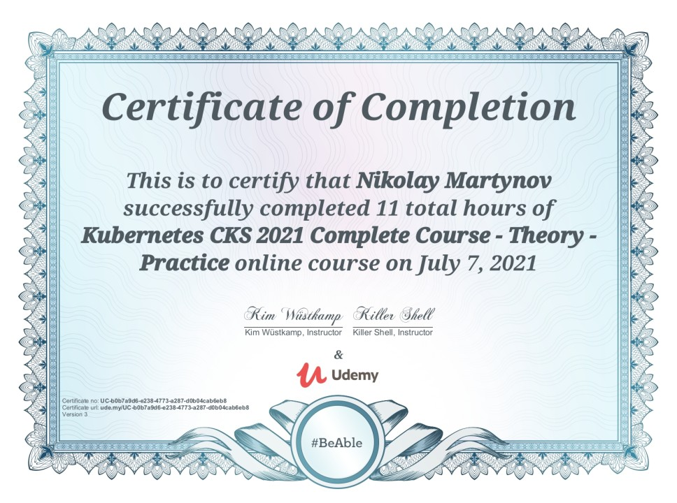

= Kubernetes CKS 2021 Complete Course - Theory - Practice

_2021-07-21_

https://www.udemy.com/certificate/UC-b0b7a9d6-e238-4773-a287-d0b04cab6eb8/

There is a very nice training by Kim Wüstkamp on link:https://www.udemy.com/course/certified-kubernetes-security-specialist/[Udemy]. If you do not want to get link:https://en.wikipedia.org/wiki/Website_defacement[defaced] then there are several things you certainly need to know and do. Kim goes over those both in theory and via practical exercises. What's nice is that he shows got to get this information and where to find more details. The course does not narrow solely on security. Instead, Kim gives enough fundamentals that even those who are not very familiar with Kubernetes will have an opportunity to learn about what to watch out (could be good for managers?).
