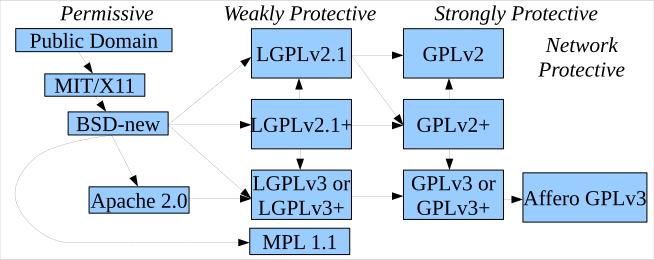

= Open Source Licensing Basics for Software Developers (LFC191)

_2021-09-08_

I can't say it's a nice course about a nice topic that everyone likes to learn. But it's a course from Linux Foundation and I have to say it gives most of what's needed by developer: https://trainingportal.linuxfoundation.org/learn/course/licensing-basics-for-developers-lfc191 You still have to have confirmation from your enterprise legal department about what is the list of licenses to stay away from and what is the list of licenses that are "safe" to be used. The course does not even try to deeply compare GPL with MIT but it explains why it matters. And it matters indeed!

In the world of Gradle and Maven, developers could easily add new dependencies without a second thought. In the world of GitHub, developers could easily copy a piece of code and then just paste it into your corporate intellectual property. In the world of StackOverflow, developers could easily copy the first answer and paste into the code to be shipped to customer under your corporate EULA with your corporate copyright in your patented product. If something is in Internet and shown by Google in search results, it does not yet mean it is in public domain and can be freely used in any way. This might be obvious but might be not. For example, do you know the difference between copyright, authorship and license? It does matter in a corporate world. And especially if you are a software vendor.

There are still many developers from the times when open source was not that rich and evolved. Many developers do not learn such a stuff in universities. It might be important to guide them about what to do and not to do, how to do it and, most important, why it matters at all. The course is helpful both for developers (because it is well structured and gives lots of practical examples) and for those who will guide others (because it gives you a credible source to reference and enables clearer communication).

