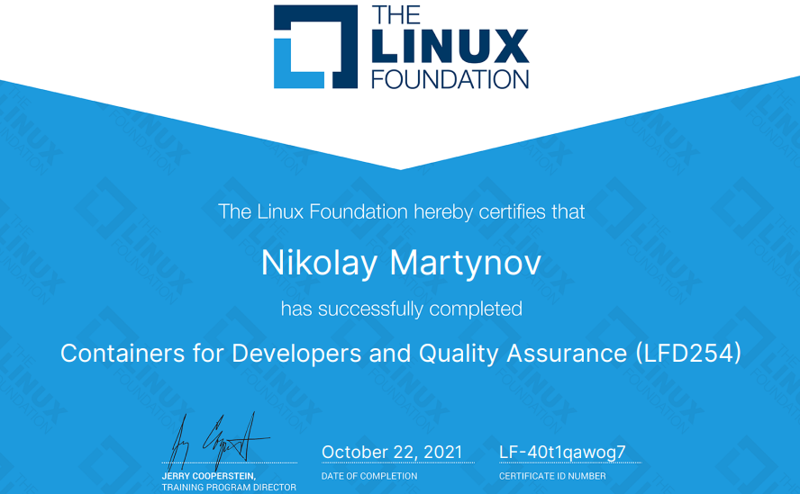

= Containers for Developers and Quality Assurance (LFD254)

_2021-10-31_

Another course from link:https://linuxfoundation.org/[The Linux Foundation]: link:https://trainingportal.linuxfoundation.org/learn/course/containers-for-developers-and-quality-assurance[Containers for Developers and Quality Assurance (LFD254)]. It's quite long and covers very wide range of topics starting from how containers actually works and finishing with how to setup CICD in Kubetneres. I find the course useful for different roles for several reasons:

* The people who have used Docker previously to run something locally and build simple images might think they've mastered the technology. However, often they do not really understand how it works. Often they might miss the limitations. Sometimes it's hard for them to understand why best practice recommends something while there are dozen other ways that are just simpler. The course covers "under the cover" (namespaces, cgroups, overlay fs) as well as compares with alternative technologies like podman. It explains the "why" and what are the issues and how alternate technologies approach those issues. This could save a lot of arguing. Sometimes people ask why do they need Kubernetes while they can stick with Swarm. Sometimes people wonder what is the stupid idea with podman and runc. The course explains what is the relationship between Docker, containerd, runc, CRI, cri-o and what's the idea with podman, buildah and kaniko. The course gets into details of storage and network options and how those work inside and how this helps get you covered with your practical needs of applications in various scenarios. From bind mounts all the way to link:https://doc.traefik.io/traefik/[Traefik].
* If you're already covered the manuals and theory then there is still a lot to learn. For example, course shows when and how you can use link:https://github.com/nicolaka/netshoot[netshoot] for network troubleshooting. I find this very interesting and useful. The course has many such examples that go beyond just theory of containers. Among others are link:https://tekton.dev/[Tekton] and link:https://argo-cd.readthedocs.io/en/stable/[ArgoCD].
    Despite what's being said previously, the course is quite nice to attend to and things are explained really good. This means, the course can be used to introduce Docker, containers and Kubernetes to people whose primary role is not that technical. Of course, the difference between config map and a secret might be not that important and interesting for a manager. However, it might help to understand engineers if you know the difference between the pod and the deployment.

The course is not perfect and there are several issues with the statements it gives and the content is uses (cmd/entrypoint confusion and contradiction, inability to control spring boot applications via environment variables and rebuilding whole image just to change property value). However, such issues are not critical. Given the depth and breadth I would very much recommend the course: https://trainingportal.linuxfoundation.org/learn/course/containers-for-developers-and-quality-assurance

https://trainingportal.linuxfoundation.org/learn/certificates/containers-for-developers-and-quality-assurance?id=81c70cad-e1a4-4bab-8113-874004a1d5e9
