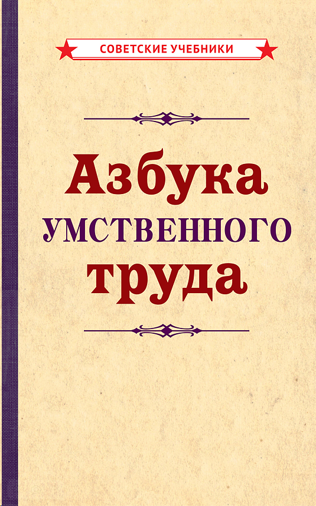

= Азбука умственного труда

_2022-02-27_

Прочитал link:https://stalins-bukvar.ru/catalog/samogobrazovanie/azbuka_umstvennogo_truda_rebelskiy_i_v_1929/[_Азбука умственного труда_] из серии _Советские учебники_. Книга небольшая и по своей сути это не столько книга сколько сборник лекций для изучающих политэкономию и политработников. Закономерный вопрос: зачем это ведущему программисту и какую вообще ценность все это имеет в 2022 году? Есть ценность и есть смысл. Да, книга во многом имеет отпечаток идеологии. Но это не её суть, а лишь небольшой налет.

Часто сталкиваюсь с тем, что иногда сотрудникам сложно организовать работу; сложно подступиться к большому сложному проекту. Здесь как раз и могут помочь первые главы Азбуки умственного труда. Название может показаться глупым и несерьезным, да и такие понятия как норма выработки может показаться неэффективным пережитком советской эпохи. А чем отличаются карточки в Scrum и Kanban? Чем отличается разбиение историй на более мелкие сценарии, чтобы карточки по их реализации не длились всю итерацию? Разве нам не нужен общий план проекта и общая последовательность работ при разработке продукта? Разве в карточках нет тех же самых деталей? Да тоже самое definition of done, acceptance criteria и demo. Те же самые принципы планирования, которые позволяют с высокой вероятностью уложиться во временной бюджет реализовав при этом критичный функционал и большую часть некритичного. При этом, не сгорев самому и сохранив работоспособность сотрудников. Много параллелей с Lean development (бережливая разработка).

Середина будет очень полезна школьникам и студентам. Учить учиться сложившемуся программисту уже поздно. Если не продолжаешь подтягивать знания, не умеешь и не хочешь, то книга не спасет. Однако, если надо освоить новый язык, фреймворк или даже целую область может быть проще используя системный подход и рабочую методику.

Часто приходится слушать тренинги, доклады. Очень бывает жалко далеко уже не студентов, которые не могут доложить по своей теме. И с материалом бывают серьезные проблемы и с самим докладом. Не конференция получается, а позор. С обучением часто не лучше. Тренер часто зачитывает, то в чем слабо разбирается. Потеря времени для аудитории и позор для тренера. Кажется, что сделай раз, сделай два, посмотри как делают другие и научишься. Но это не работает. По крайней мере, далеко не всегда. Последние главы Азбуки как раз в помощь. И вопрос не в том как слайды нарисовать, а в том что на них написать/нарисовать, в каком порядке расположить, что показать, а что рассказать. Как рассказывать, как вести себя перед аудиторией.

Конечно, человек — не робот. Все не запомнишь, с книжкой сидеть не будешь и по ней прям делать тоже не будешь. Но программисты большую часть времени работают с алгоритмами и вокруг алгоритмов. Если основные вехи методик и рецептов остались где-то под коркой, то в нужной ситуации они всплывут и будет легче. Ну а в особенно ответственных случаях можно и перелистать и освежить, может даже что-то подсмотреть.
