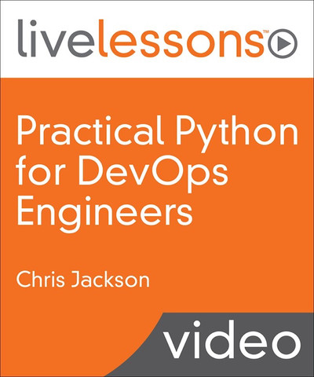

= Practical Python for DevOps Engineers

_2022-04-11_

link:https://learning.oreilly.com/videos/practical-python-for/9780137659067/[Practical Python for DevOps Engineers] - небольшой видеокурс от Chris Jackson ("best-selling author" link:https://learning.oreilly.com/search/?query=author%3A%22Chris%20Jackson%22&extended_publisher_data=true&highlight=true&include_assessments=false&include_case_studies=true&include_courses=true&include_playlists=true&include_collections=true&include_notebooks=true&include_sandboxes=true&include_scenarios=true&is_academic_institution_account=false&source=user&sort=relevance&facet_json=true&json_facets=true&page=0&include_facets=true&include_practice_exams=true[полутора десятков курсов и книг]). Казалось бы, то, что надо для одного из следующих случаев:

* Быстро ввести в Python состоявшихся программистов (например тех, кто ранее работал на Java)
* Освежить на практических примерах память о Python тем, кто ранее имел с ним дело
* Ознакомить с идеями DevOps, либо углубить список рецептов

К сожалению, рекомендовать данный курс никак не могу никому ни для каких целей.

* Те, кто программирует давно, уснут на разжёвывании базовых концепций переменной, цикла, класса и тому подобного. Даже стажёр всё это уже должен знать.
* Тем, кто только начал карьеру программиста, этот курс и вовсе противопоказан. Многие вещи определяются и толкуются неверно.
* Автор долго и мутно объясняет, что такое HTTP, JSON, XML, REST, SOAP и тому подобные вещи. Очень долго. Очень нудно. Но при этом очень поверхностно и очень мутно. Ощущение, что автор прочитал что-то в википедии, но практического опыта работы с тем, о чем пытается рассказывать, не имеет.
* Никаких шаблонов и рецептов из мира DevOps с примерами реализации на Python я так и не увидел.

Пара полезных моментов в представленных примерах была. Но терпеть ради них всю остальную часть нет никакого смысла.
