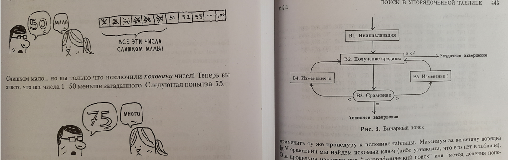
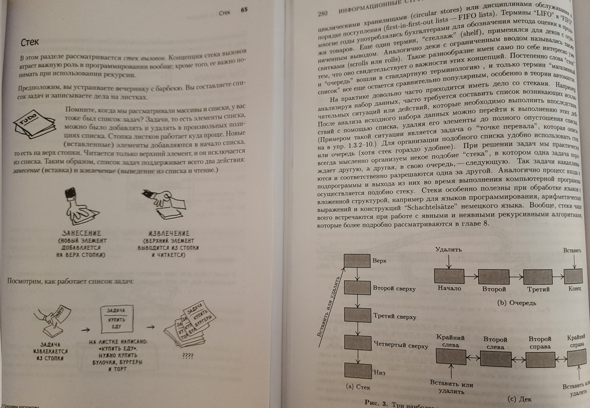
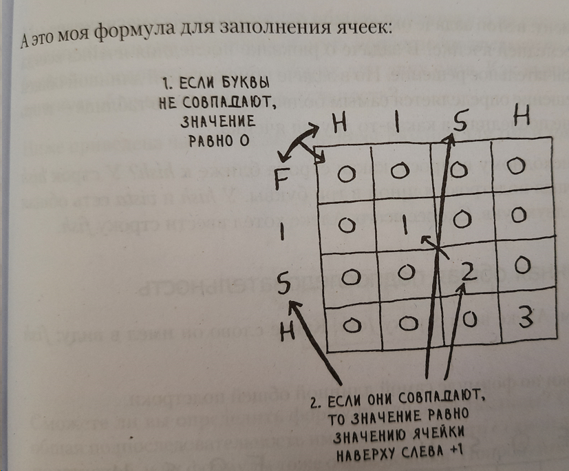

= Грокаем алгоритмы

_2022-05-04_

link:https://www.piter.com/collection/all/product/grokaem-algoritmy-illyustrirovannoe-posobie-dlya-programmistov-i-lyubopytstvuyuschih-2[Грокаем алгоритмы. Иллюстрированное пособие для программистов и любопытствующих] от Бхаргава А. Эта книга рекомендована Яндекс Практикум при подготовке к алгоритмическому собеседованию. Сам автор указывает, что книга для самоучек, студентов, выпускников и тех, у кого программирование не является основным профилем.

Мое впечатление неоднозначно. С одной стороны, до сего момента я не встречал описания динамического программирования, поиска кратчайшего пути в графе по алгоритму Дейкстры и использование K ближайших соседей для классификации и аппроксимации (возможно, все это есть в 4^м^ или последующих томах Кнута, но в магазине они мне не встречались). С другой стороны, описания и примеры, приведенные в книге, таковы, что практической пользы не представляют. Описания очень поверхностны, примеры нарочно примитивны, код в половине случаев не приведен. Но даже там где есть код, он нарочито упрощен под конкретный пример и на практике бесполезен.

Казалось бы, есть масса книг - каталогов шаблонов. Они реально полезны и новичку и профессионалу. Эта книга не из их числа. Но, видимо, это и не было целью. Напоминает научно-популярные книги издававшиеся в СССР: простым языком рассказывает о сложных вещах, прививает у читателя интерес к теме, расширяет кругозор. Не более. Но тоже важно.

Вернемся к Яндекс Практикум и их рекомендации. Если алгоритмы так важны, то почему именно эта книга? Есть масса других, где и алгоритмов больше и разобраны они так, что бери да пользуй. Например, классический труд Д. Э. Кнута Искусство программирования. Да, рисунки в детском стиле в Грокаем алгоритмы забавны. Но иллюстрации в Искусство программирования полезны для понимания. Разве это не важнее, если уж кандидата посылают на алгоритмическое собеседование?

Если алгоритмы так важны с точки зрения Яндекс Практикум, то почему они советуют именно Грокаем алгоритмы, где приведены далеко не самые эффективные реализации? К примеру, сортировка выбором (в ГА) создает новый массив, который, к тому же, динамически растет. У Кнута приведен алгоритм сортировки выбором с обменом (5.2.3), не требующий дополнительной памяти ни на копию, ни на копию копии при динамическом росте.

На сколько по полочкам у Кнута разобрана работа стека, на столько же сумбурно про это рассказано в Грокаем алгоритмы.

А ведь это база для рекурсивных алгоритмов. Про то, что стек может быть конечного и даже малого размера в ГА не сказано. Лишь упомянуто вскользь, что могут быть высокие затраты памяти. А ведь, как правильно указано в 1^м^ томе "link:https://www.ozon.ru/product/informatika-osnovopolagayushchee-vvedenie-chast-i-116483/?sh=blwbNJVwCQ[Информатика. Основополагающее введение]" от Манфреда Броя, при каскадной рекурсии "вызовы лавинообразно ведут к экспоненциальному нарастанию возникающих рекурсивных вызовов ("каскад вызовов")". И именно такой вариант быстрой сортировки расщеплением приведен в ГА. Также автор не стесняется склеивать три массива на каждой итерации. Если важна эффективность, как уверяет Яндекс Практикум, то быструю сортировку надо смотреть не в ГА, а снова у Кнута, где алгоритм обменной сортировки с разделением (5.2.2) не требует ни дополнительной памяти, ни склеивания половин.

Не менее интересно в ГА разобраны хеш-таблицы и хеш-функции, о которых нам "никогда не придется беспокоиться" ибо об этом уже побеспокоились "пожилые бородатые умники, сидящие в полутемных комнатах" (цитата из книги). Ладно, если бы это было просто безобидно, но автор рекомендует использовать SHA при реализации своих хеш-таблиц. И где будет эффективность, о которой говорит Яндекс Практикум? Для сравнения, если просто почитать 6.4 в т.3 Кнута, то станет по крайней мере понятно почему до Java 7 стандартный шаблон сгенерированного `hashCode()` выглядел следующим образом:

[source,java]
----
@Override
public int hashCode() {
    int result = target.hashCode();
    result = 31 * result + (optimal ? 1 : 0);
    result = 31 * result + parent.hashCode();
    return result;
}
----

Поиска в ширину и жадных алгоритмов в первых трех томах Кнута нет. Но их описание в ГА можно сравнить с описанием в "link:https://www.ozon.ru/product/iskusstvennyy-intellekt-strategii-i-metody-resheniya-slozhnyh-problem-1484768[Искусственный интеллект. Стратегии и методы решения сложных проблем]" от Джорджа Ф. Люгер. В ГА более длинно и более разжёвано, а потому и более понятно.

Алгоритма Дейкстры для поиска кратчайшего пути, равно как и динамического программирования в моей библиотеке ранее не было. Однако глубина изложения и примитивность примеров в ГА не позволяют их сходу использовать на практике. Автор запросто опускает начальные условия и приводит код под конкретный пример. Все это безобразие венчает "а это моя формула":

Вместо объяснения как он пришел к данной "формуле" или в чем ее физический смысл, дабы читатель мог использовать схожий подход в своей практике, автор успокаивает: "Если у вас голова идет кругом, не огорчайтесь. Это сложный материал". И по алгоритму Дейкстры, и по динамическому программированию я бы рекомендовал дополнительно почитать link:https://ru.algorithmica.org[]. Так оно будет гораздо понятнее, чем только после прочтения ГА.

На методе K ближайших соседей автор ГА либо устал, либо сам толком метод не освоил. Об этом можно судить и по корню в Евклидовой метрике, и по отсутствию нормализации. Если у нас миллионы точек в многомерном пространстве, то найти _по запросу_ таким образом 5 соседей на практике вряд ли получится, особенно, если запросы приходят в параллель. Книга не упоминает, что все это очень дорого и по памяти, и по времени. А ведь Яндекс Практикум говорит именно об эффективности. Чтобы более полно ознакомиться с методом K ближайших соседей и понять аспекты его практического применения, вариации и альтернативы, я бы рекомендовал link:https://ml-handbook.ru/chapters/metric_based/intro[описание] в онлайн-учебнике по машинному обучению от Школы анализа данных.

Все, что идет в книге далее, несерьезно рассматривать более чем как _see also_.

Что можно сказать резюмируя? В принципе, выполнение упражнений полезно (как минимум, я снова убедился, что писать на Java проще, чем на C++). Также опытный разработчик может встретить какие-то новые вещи - это тоже всегда полезно. Не программисты и начинающие разработчики наверняка найдут книгу легкой в чтении и увлекательной. И это хорошо. Но вообще хотелось бы каталога алгоритмов наподобие link:https://www.labirint.ru/books/87603/[GoF], link:https://www.labirint.ru/books/512948/[EIP], link:https://github.com/nikolay-martynov/profile/blob/main/blog/2019-06-20-Software-Architecture-Patterns.adoc[Software Architecture Patterns] and link:https://github.com/nikolay-martynov/profile/blob/main/blog/2019-10-02-Designing-Distributed-Systems.adoc[Designing Distributed Systems].

Примеры выполнения упражнений: https://github.com/nikolay-martynov/grokking-algorithms
