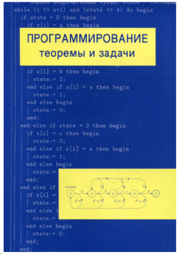
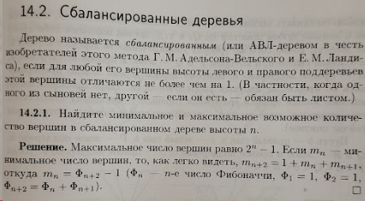
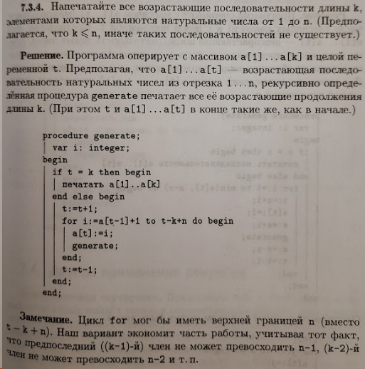
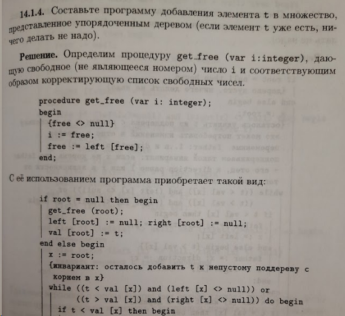

= Программирование: теоремы и задачи

_2022-05-21_

После неудачного (с точки зрения эффективности траты времени) погружения в "link:https://habr.com/ru/post/664360/[Грокаем алгоритмы]" по совету Яндекс Практикум и решения нескольких задач в "Бесплатный курс: подготовка к собеседованиям" от того же Яндекса решил поискать литературу на тему разбора задач. Довольно много рекомендаций указывало на книгу "link:https://www.labirint.ru/books/800986/[Программирование: теоремы и задачи]" от Александра Шень. Предыдущее издание книги можно, кстати, официально link:https://mccme.ru/free-books/shen/shen-progbook.pdf[скачать] с сайта издательства Московского Центра Непрерывного Математического Образования.

Сам автор характеризует книгу как справочник и задачник для преподавателя. Причем во введении и аннотации упоминает школу на порядок чаще университета. Да и формулировки многих задач намекают на школьную аудиторию. На этом стоит остановиться сразу. Речь может идти только об очень очень особой школе и очень очень особых школьниках. Например, таких, которые ходят на математический кружок мехмата МГУ, где математически доказывают выигрышную стратегию при игре в крестики-нолики. 90% материала выходят за рамки школьной программы по информатике. Да и некоторые задачи используют математический аппарат, который тоже в школьный стандарт не входит. Не стоит отметать эту книгу как что-то для маленьких и неразумных.

Напомню характеристику автора: справочник и задачник. Для справочника важны: удобство поиска, широта охвата, понятная формулировки задачи или проблемы, понятная формулировка решения, указание особенностей и ограничений. Рассмотрим подробнее:

* Поиск: в принципе, предметный указатель в конце книги позволяет найти нужные вещи по ключевым словам. Но о какой-то каталогизации и систематизации алгоритмов и приемов речь не идет.
* Охват: здесь описана классика вроде поиска, сортировки, структур данных (графы, стеки, хеш таблицы, деревья и т.п.), конечных автоматов; также тут описаны более редкие темы наподобие динамического программирования, теории игр, потоков (не в плане многозадачности, а в смысле сетей и пропускной способности), сжатия данных, синтаксического разбора. К сожалению, формат книги (320 небольших страниц) предопределяет небольшую глубину погружения в каждую из тем. По каждой теме автор дает введение и, на его взгляд, самое интересное. Здесь не найти всех сортировок, всех алгоритмов на графах, всех типов деревьев. Конечно, владеть тем, что описано - это уже немало. Но все-таки не формат справочника.
* Формулировка задач: большинство задач сформулированы нейтрально и четко вроде "дан массив таких-то чисел, дано такое-то число, надо найти то-то". Во многих местах есть поясняющие примеры или пояснения. Однако, если мы говорим о классических справочниках вроде link:https://www.labirint.ru/books/87603/[GoF], link:https://www.labirint.ru/books/512948/[EIP] и тому подобном, то все же такие формулировки не слишком удобны. Тем более, что найти нужную задачу сложно. У задач есть только номер и они никак не каталогизированы.
* Разбор решений: решения приведены примерно для половины задач. В большинстве случаев это готовые программы на паскале. Иногда псевдокод, но не забывающий про начальные и граничные условия. Часть задач не предполагает написание программы и тогда в решении даётся текстовое объяснение. Сложные решения тоже снабжены объяснениями. Иногда тема разбита на несколько подзадач и полное решение строится постепенно. Стоит отметить, что задачи с решениями - это примерно половина книги. Есть главы, где только теория или алгоритм приводится только в виде общего описания. Я не отказался бы почитать реализацию поиска минимальной стоимости разрезания многоугольника или реализацию подсчета пропускной способности сети трубопроводов. Итого получается, что готовые решения приведены для четверти-трети материала. Иллюстраций маловато, а они были бы полезны для пояснения работы многих нетривиальных алгоритмов.
* Особенности и ограничения: часто встречаются пометки, что если бы условия были немного другими, то можно было бы решить проще. Естественно указывается какими и как. Иногда встречаются хитрости вроде вставки фиктивного элемента для упрощения проверки конца цикла. Часто указаны ограничения (например, что алгоритм вырезания комментариев, не понимает вложенные комментарии, и приводится пример того что получится в этом случае, и объяснено почему).

Значительная часть места отводится под *доказательство* корректности программ, алгоритмов и предположений об их эффективности. С одной стороны "ничего непонятно, но очень интересно", а с другой, если бы речь шла именно о справочнике, то это место можно было бы использовать либо для более детального разбора решений (иногда приходится мысленно трассировать программу, чтобы понять, как она работает, а текстовое объяснение идеи алгоритма могло бы помочь), либо для того, чтобы привести решение там, где его в настоящий момент нет.

Про задачник: в первой части задач много и над ними интересно подумать, но часть глав больше про теорию, там задания, если и есть, то они на доказательство теорем и утверждений.

Резюмируя: читать разбор решений и поразмыслить, там, где решения не приведены, было интересно; интересно было читать про темы, которые более глубоко разобраны, чем в той же "Грокаем алгоритмы" (например, про динамическое программирование); интересно было ознакомиться (хоть и очень поверхностно) с новыми темами вроде теории игр и потоками. В целом книгу я бы к прочтению рекомендовал. Если базиса нет, то тут он дан. Если базис уже знаком, то для разминки и расширения кругозора.
