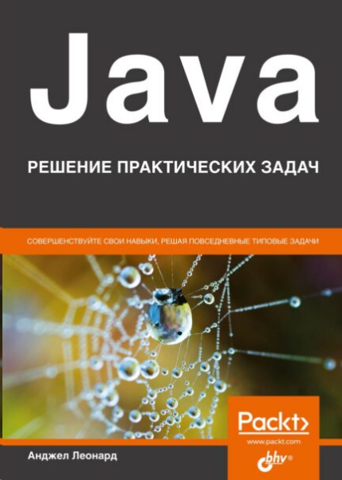

= Java. Решение практических задач

_2022-06-07_

link:https://bhv.ru/product/java-reshenie-prakticheskih-zadach/[Книга] Анджела Леонарда позиционируется как каталог типовых решений для Java разработчиков младшего и среднего уровней. Заявляется, что представленные решения производительны, корректны и поддерживаемы.

В книге все разбито на "задачи". Они тут нескольких типов:

* Алгоритмические задачи - 10%
* Структуры и алгоритмы - 5%
* Теория языка Java - 10%
* Стандартная библиотека Java - 50%
* Практические приёмы - 25%

*Алгоритмические задачи* здесь начального уровня. Их мало. Но самое интересное - это предлагаемые решения. Автор пишет, что книга поможет укладываться в сроки. В этом она похожа на рецепты со https://stackoverflow.com/ с ровно тем же результатом: работать может и будет, но в большинстве случаев так делать не стоит. Нет, я, конечно, больше за экономическую целесообразность и согласен с цитатой:

"Преждевременная оптимизация — корень всех зол."
-- Д. Э. Кнут

Но приводить настолько неэффективные решения в качестве эталонных стоило бы постесняться. Можно говорить, что такой подход улучшает читаемость, а значит и сопровождаемость, но ведь заявлено, что приведены

[quote]
правильные практические приемы и технические решения в отношении сложности, *производительности*, удобочитаемости

По поводу удобочитаемости тоже можно было бы поспорить, но это, в конце концов, дело вкуса. Но вот неэффективность никуда не денешь. Например, в задаче отыскания самого часто встречающегося символа предлагается в карте символ->количество искать максимум через `Collections.max()` для `values()`, а потом ещё циклом пройтись по `entrySet()` и поискать какой же `getKey()` соответствует значению, которое вернула `Collections.max()`.

Автор часто прибегает к регулярным выражениям там, где они совершенно излишни. И даже не предлагает их предварительно компилировать, а все время норовит вызвать `replaceAll()` или `split()` прямо внутри тела цикла. Опять же, можно было бы поспорить, что `split()` оптимизирована для случая односимвольного разделителя и не будет для них применять регулярные выражения. Однако, автор про это ни разу не упоминает. Более того, автор регулярно напоминает использовать `Pattern.quote()` при передаче параметра в `split()`, а значит он подразумевает именно регулярные выражения. Но даже если опираться на оптимизацию `split()` для односимвольных разделителей, то можно link:https://github.com/openjdk/jdk/blob/master/src/java.base/share/classes/java/lang/String.java#L3126-L3155[видеть], что внутри у нас `ArrayList` из которого данные копируются в новый массив, а автор после чуть ли не каждого `split()` предлагает конвертировать массив в список через `Arrays.asList()`. Копирования и мусор в куче, который надо будет собирать, автор просто игнорирует. `StringTokenizer`, по утверждению автора, обладает меньшей производительностью и из-за этого его не рекомендуется использовать. Нет, `StringTokenizer`, рассчитанный на Unicode code pointы и несколько разделителей, действительно медленнее в плане обработки строки по сравнению со `split()` при односимвольном разделителе (за вычетом дополнительного мусора и копирований). Но автор в своей сноске явным образом говорит про гибкость регулярных выражений. Да, в link:https://github.com/openjdk/jdk/blob/master/src/java.base/share/classes/java/util/StringTokenizer.java#L77-L80[Javadoc] на `StringTokenizer` есть рекомендация по использованию `split()`, но там нет ничего про производительность. На самом деле речь идет о том, что `StringTokenizer` - это `Enumeration`, а не `Collection` и значит придётся писать явный цикл для обхода, копирования и тому подобного. Не более.

[source,java]
----
StringTokenizer tokenizer = new StringTokenizer("abc, def, xyz", ";, ");
List<String> tokens = new ArrayList<>(tokenizer.countTokens());
while (tokenizer.hasMoreTokens()) {
    tokens.add(tokenizer.nextToken());
}
----

Ну или тупо `Collections.list()`, если лень или повторное сканирование перевешивает динамический рост списка. Если хочется красоты и однострочности, то начиная с Java 9 можно сделать `.asIterator().forEachRemaining()` и оно ничем не будет отличаться от цикла for-each.

[source,java]
----
new StringTokenizer("abc, def, xyz", ";, ")
        .asIterator().forEachRemaining(System.out::println);
----

Вообще автор везде сует потоки с цепочками вызовов заканчивающимися `collect(Collectors.toList())` и ни разу не упоминает, что список будет динамически расти, что данные будут копироваться, что мусор потом придется собирать.

Можно опять поспорить, что это копейки и на сложность алгоритма в целом не влияет. Плюс/минус 5-10% (кто же будет профилировать?) - не высокая цена за скорость разработки. Пусть так. Соглашусь. Часто важнее скорость разработки, а не скорость работы. Но тут же можно найти рецепт как скопировать объект через JSON:

. Берем исходный объект
. Сериализуем его в JSON
. Парсим получившийся текст
. Копия объекта готова!

И это не прикол, а целая "задача" с детальным описанием _рецепта_ и примером кода. Бери и копипасти. И ни слова о том, на сколько это будет быстро.

Часто говорят, что Java - это тормоза и излишнее потребление памяти. Есть мнение, что проблема не в Java, а в том как на Java пишут. Так вот автор не сильно старался сделать решения эффективными по времени или потреблению памяти.

Про *структуры и алгоритмы* в книге откровенно мало. В стандартной библиотеке конечно много всего готового и свое реализовывать надо не так уж и часто. Но можно было бы рассказать про варианты представления деревьев и графов с использованием инструментария Java. Дерево Фенвика и фильтр Блума здесь рассмотрены чисто для галочки.

Много "задач", в которых *рассказывается о самом языке Java*. В основном речь идет о нововведениях после Java 8:

* Новые выражения `switch`
* Автоматический тип локальных переменных и `var`
* Функциональные интерфейсы и лямбда-выражения

С одной стороны это все полезно. Даже не новичку. Особенно когда подается в виде практических рецептов. Но есть проблемы. Например, автор утверждает, что автоматические типы улучшают сопровождаемость кода. Приводится пример, когда локальная переменная - результат возврата функции, функцию позже поменяли и автоматическая переменная волшебным образом изменила свой тип. В коде ничего менять не надо и все счастливы. Другой пример - использование автоматического типа для "исправления" непонимания программистом того, какой же тип вернет тернарный оператор. Ну или предложение прятать тип элемента в цикле for-each. Я бы еще мог понять, если бы речь шла о длинных вложенных обобщенных типах:

[source,java]
----
Map<String, String> headers = new HashMap<>();
for (Map.Entry<String, String> entry : headers.entrySet()) {

}
----

Тогда хоть какой-то смысл появляется:

[source,java]
----
Map<String, String> headers = new HashMap<>();
for (var entry : headers.entrySet()) {

}
----

Но автор говорит о другом. О том, что можно менять тип элементов коллекции (с `int` на `String`) и не заморачиваться изменением кода. Сразу вспоминаешь, что Groovy ругают за `link:https://www.groovy-lang.org/semantics.html#_variable_definition[def]`.

Также сомнительны рецепты с заменой классических шаблонов на лямбды. Смысл ведь был в инкапсуляции и полиморфизме, а тут все кишки наружу. Нет, кодить конечно быстрее, но будет ли экономия, когда придётся выбросить и переписать с нуля?

Не могу согласиться с рецептами тестирования лямбд. Тестирование - это проверка соответствия контракту. Какой контракт у лямбда-выражения? Аналогично с отладкой путем `System.out.println()`. Кто, как и когда будет всё это потом вычищать? А ведь будут последствия. Вместо навязчивой рекламы лямбда-выражений и рекомендаций по запихиванию их всегда и везде стоило бы описать где и когда их применять не стоит и как и на что их надо заменить. С примерами.

*Стандартная библиотека* - это основная часть книги. Масса рассказов, что есть вот такой-то класс или метод, полезный тем и этим. Много и более практических рецептов: если стоит такая-то задача, то решается она так-то. В принципе, все эти практические рецепты работы с датами, коллекциями, файлами, потоками, интроспекцией, многопоточностью, инструментами синхронизации, клиентом HTTP и WebSocket полезны. Особенно, если не штудировал Javadoc и не читал link:http://www.williamspublishing.com/Books/978-5-907114-79-1.html[Core Java] в link:http://www.williamspublishing.com/Books/978-5-907144-38-5.html[двух томах].

Но в бочке мёда снова не обошлось без кастрюли дёгтя ибо есть масса неточностей и неверностей. Например, рекомендуется локальную дату конвертировать в UTC, используя нулевой сдвиг. Работать это будет только в городе Гринвич.

[source,java]
----
LocalDateTime local = LocalDateTime.now();
Instant suggested = local.toInstant(ZoneOffset.UTC);
Instant correct = local.atZone(ZoneId.systemDefault()).toInstant();
----

Другой пример, когда автор утверждает, что `List.replaceAll()` и цикл с `List.set(i,v)` "должны работать практически одинаково". Для `ArrayList` это может и так, но есть и другие списки. Нет, работать `LinkedList.set(i,v)` в цикле будет конечно корректно, но совсем не также как `ListIterator.set(v)`, используемый в `LinkedList.replaceAll()`. Автор на такие мелочи внимание не обращает.

Частенько автор противоречит Javadoc. Например, при описании `ExecutorService.invokeAll()` написано:

[quote]
первый вызов метода `Feature.get` блокирует до тех пор, пока не будут завершены все экземпляры `Feature`

То есть, как будто между разными `Feature` есть какая-то связь и они друг друга ждут. На самом деле ничего такого не происходит, а блокируется не столько `Feature.get()`, сколько `link:https://docs.oracle.com/en/java/javase/17/docs/api/java.base/java/util/concurrent/ExecutorService.html#invokeAll(java.util.Collection)[ExecutorService.invokeAll]`.

Ну или другой пример расхождения с официальной документацией - это секция про `StampedLock` и оптимистическую блокировку. Весь смысл оптимистичных блокировок в отсутствии блокировок. В данном случае, если очень много читателей, то писатель может ждать слишком долго, особенно для non-fair случая по умолчанию. Так вот `StampedLock` как раз и позволяет избежать блокировки писателя. Правильный пример кода можно найти в link:https://docs.oracle.com/en/java/javase/17/docs/api/java.base/java/util/concurrent/locks/StampedLock.html[официальной документации]:

[source,java]
----
double distanceFromOrigin() {
 long stamp = sl.tryOptimisticRead();
 try {
   retryHoldingLock: for (;; stamp = sl.readLock()) {
     if (stamp == 0L)
       continue retryHoldingLock;
     // possibly racy reads
     double currentX = x;
     double currentY = y;
     if (!sl.validate(stamp))
       continue retryHoldingLock;
     return Math.hypot(currentX, currentY);
   }
 } finally {
   if (StampedLock.isReadLockStamp(stamp))
     sl.unlockRead(stamp);
 }
}
----

Перед возвращением (фиксацией результата) мы проверяем не было ли значение изменено. При необходимости перечитываем и заново вычисляем. Мы стараемся, по возможности, избежать `readLock()`, которая заблокирует писателей.

А что предлагает автор? Автор предлагает делать `validate()` _сразу за_ `tryOptimisticRead()` и _ничего не делать_, если `validate()` скажет, что записи не было (между `tryOptimisticRead()` и `validate()`). Налицо непонимание того, как работает `StampedLock` и нежелание разобраться в примере из библиотечной документации.

*Практические приёмы* - это всякие полезные практические хитрости, которые напрямую не указаны в документации, ну или просто указание на неприметный, но полезный класс в стандартной библиотеке:

* Преобразование 1000 в 1K и тому подобное
* Комбинирование `Stream.reduce()`, `Function.identity()` и `Function.andThen()` на списке функций для вызова их цепочкой
* Генераторы потоков

Сильно портит книгу перевод:

* Масса опечаток
* Для многих терминов используется транслитерация вместо перевода ("состояние терминации", "дерегистрированных участников", "конкурентно запустить", "с несколькими имплементациями этого интерфейс")
* И наоборот, некоторые термины переведены крайне странно ("обход должен быть жестоко терминирован", "альтернатива подклассированию", "стековая трасса сбоя", "замок на уровне объекта", "будет уменьшать стопор", "семафор может начинаться и умирать", "продвинуть исключение", "приращение", "атомарно наращивает переменную")
* Ближе к концу книги, переводчик перестал заморачиваться и так и оставил машинный перевод с тут и там несогласованными окончаниями.

Орфография - это неприятно, но терпимо. Но терминология - это серьезней. Часть просто неприятно читать. Например, все эти _многонитиевости_. Причем, переводчик не поленился и расписал целую секцию почему именно _нити_, хотя редактор в сноске указала, что _потоки_. Но или уговорить не удалось, или (что видно по числу опечаток) ограничилась первым десятком страниц.

Вот научится человек _стопорам_, _тупикам_ и _запираниям на замок_, и попробуй, пойми потом, что речь о `CountDownLatch`, _deadlock_ и _acquire lock_ (_затвор_, _взаимная блокировка_ и _получение блокировки_ в терминах той же link:http://www.williamspublishing.com/Books/978-5-907114-79-1.html[Core Java]).

В главе про шаблоны используется термин _трафаретный метод_. При этом, в тексте даже есть ссылка на link:https://www.labirint.ru/books/87603/[GoF]. То есть переводчик, даже если он не специалист в данной предметной области, мог просто подглядеть. А ведь шаблоны - это ещё и язык, который призван помочь в объяснении того, как система устроена или должна быть устроена.

Есть места, где корявый перевод меняет смысл написанного. Например:

[quote]
Блокирующая нить исполнения обычно находится в состоянии `BLOCKED`...

Неопытный разработчик может и не понять, что речь о том потоке, который был _заблокирован_, а не о том, который _блокирует_.

*Резюмируя*, можно сказать, что книга крайне неоднозначна. Опытный разработчик может найти что-то новое, если не следил за эволюцией. Может освежить память о том, что давно не использовал. Или даже может найти пару рецептов, о которых ранее не знал. Не очень опытный разработчик может узнать очень много. Это даже может быть лично ему полезно, чтобы "укладываться в сроки". Также как может быть полезен https://stackoverflow.com/, чтобы копипастить оттуда первый попавшийся рецепт. Если новичок "вырастит" на этой книге, то велик шанс того, что его работу придется переделывать. А ведь он ещё и может ссылаться на данную книгу в обоснование своей точки зрения. Тогда и взаимопонимание может быть затруднено. Хоть автор и позиционирует книгу для начального и среднего уровней, я бы рекомендовал её (и то не сильно) только сложившимся разработчикам. Прочитавший же её новичок будет просто опасен.
