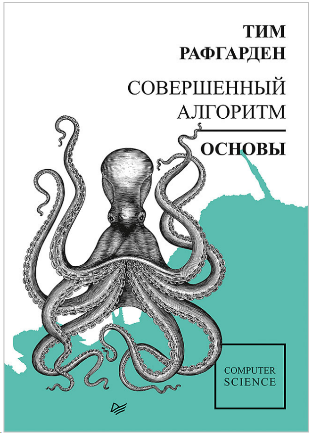
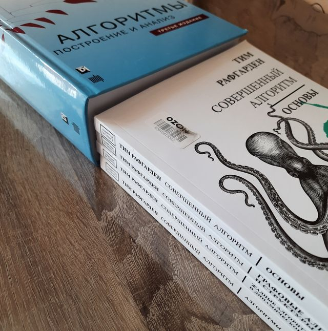
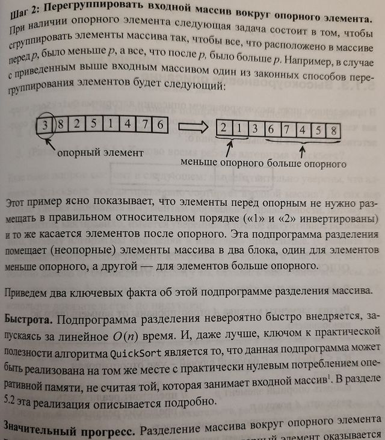
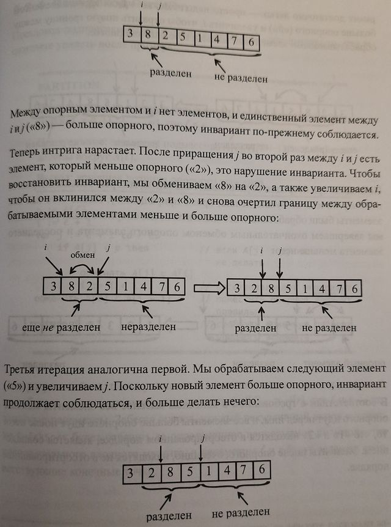
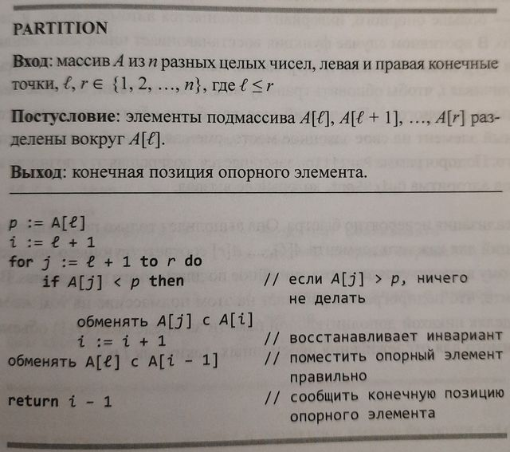
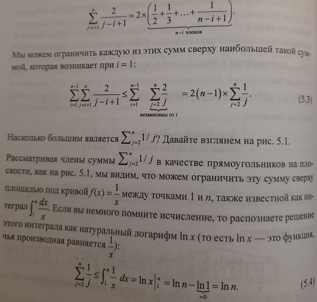
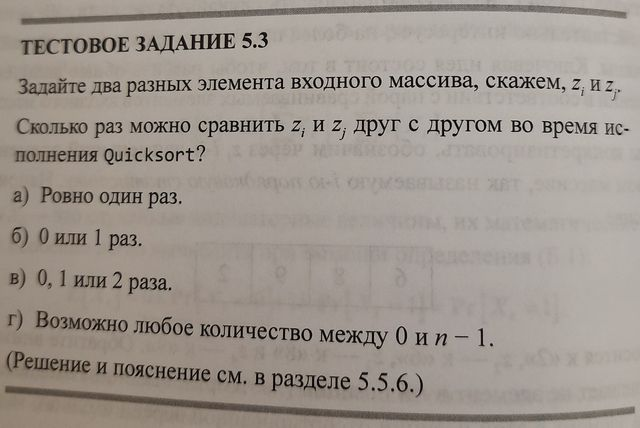

= Совершенный алгоритм. Основы

_2022-06-12_

Книга link:https://www.piter.com/collection/programmirovanie-osnovy-i-algoritmy/product/sovershennyy-algoritm-osnovy["Совершенный алгоритм. Основы"] Тима Рафгардена первая в серии из четырёх книг примерно одинакового размера. В сумме они примерно соответствуют часто цитируемой классике link:https://www.labirint.ru/books/671295/["Алгоритмы. Построение и анализ"].

И действительно, читается первая книга довольно быстро. Но это не только потому, что она небольшая, но и благодаря тому, что написана она довольно-таки живым интересным языком. По сути, это цикл лекций. Не справочник. Не каталог решений. Не академический труд. А именно лекции, которые читать интересно.

Тут нет нарочитой дурашливости и детскости как в link:https://www.labirint.ru/books/571060/["Грокаем алгоритмы"]. Одновременно, здесь очень подробные объяснения приведённых алгоритмов и их характеристик. Например, под разбор QuickSort отведено 40 страниц:

* Это и детальное описание идеи
+

* И иллюстрация пошаговой работы
+

* И псевдокод с пояснениями
+

* И математика для любителей формального доказательства корректности и сложности
+

* И тестовые задания
+

Кстати, тестовые задания довольно интересны. Подумать над ними - удовольствие. Для многих из них даны детальные разъяснения. И можно либо себя проверить, либо получить ещё одно объяснение того, что не до конца понятно.

Да, здесь нет 100500 видов сортировки, и это совсем не каталог. Но, если, например, чтение link:https://www.labirint.ru/books/695679/[Кнута] - это Труд, то "Совершенный алгоритм. Основы" - это просто интересное и увлекательное чтение.

Ознакомиться с оглавлением можно на link:https://www.piter.com/collection/programmirovanie-osnovy-i-algoritmy/product/sovershennyy-algoritm-osnovy#Oglavlenie-1[сайте издательства].
