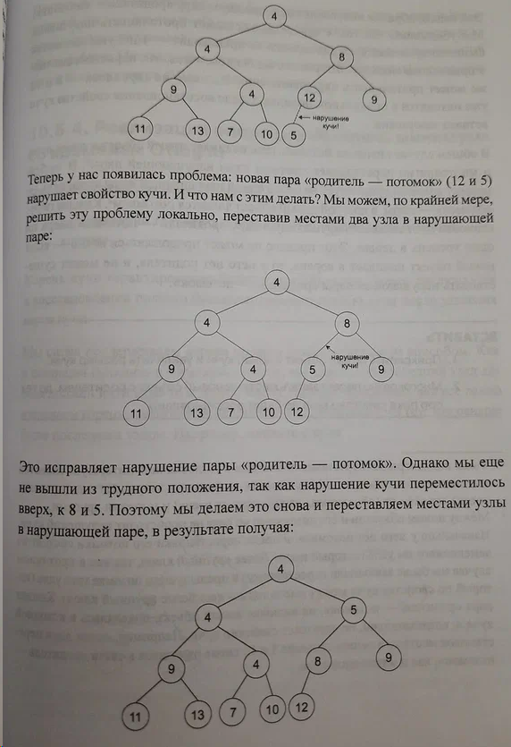

= Совершенный алгоритм. Графовые алгоритмы и структуры данных

_2022-06-23_

Вторая книга (link:https://www.piter.com/collection/sovershennyy-algoritm/product/sovershennyy-algoritm-grafovye-algoritmy-i-struktury-dannyh[_Графовые алгоритмы и структуры данных_]) из серии link:https://www.piter.com/collection/sovershennyy-algoritm[_Совершенный алгоритм_] Тима Рафгардена является продолжением, по сути, единого цикла лекций. Автор не только сохранил стиль первой книги, но и часто ссылается на материал, который был в ней преподнесён. Стиль обоих книг я считаю очень удачным. А именно, детальное и всестороннее изложение небольшого количества тем доступным языком.

Снова, это не каталог решений, а именно лекции. Поэтому автор далеко не сразу дает готовые алгоритмы. По сути, автор рассказывает как к этим алгоритмам можно прийти. Либо пробуя разные варианты, либо постепенно улучшая решения. Так например, поиск кратчайшего пути:

. Начинается с обхода в ширину
. Вводится модификация со взятием кратчайшего ребра при обходе
. Показывается, почему это не работает на отрицательных длинах, и доказывается, почему работает на неотрицательных
. Приводится анализ временной сложности
. Ставится задача быстрого поиска рёбер с минимальной длиной
. Вводится понятие кучи, необходимые на ней операции и их (желаемая) временная сложность
. Разбирается зачем и почему мы можем хранить в куче вершины, а не рёбра
. Приводятся детальные примеры где ещё такую структуру с такими операциями и их характеристиками можно было бы применить
. Даётся идея о реализации кучи в виде двоичного дерева
. Объясняется как её улучшить, перейдя к представлению в виде массива
. Детально иллюстрируется нарушение инварианта при вставке и удалении и поясняется как его восстановить

Автор не разбирает как изначально собрать кучу за линейное время (можно посмотреть, например, и код, и анализ в link:https://core.ac.uk/download/pdf/82135122.pdf[_An average case analysis of Floyd's algorithm to construct heaps_] за авторством Ernst E. Doberkat от 1984 года), не приводит готовый код вставки и удаления, не приводит финальный готовый код реализации алгоритма поиска кратчайшего пути от начала до конца. Здесь это оставлено в виде задач. Но, если сравнивать с готовым решением в link:https://www.labirint.ru/books/571060/[_Грокаем алгоритмы_], то, по крайней мере, в _Совершенный алгоритм_ понятно откуда что взялось, почему и как; поиск минимумов с линейного заменён на логарифмический.

Очень скудно рассмотрено представление графов в виде матриц смежности. Недостаточно и информации чтобы с места написать балансировку деревьев или фильтр Блума. Но повторю вывод для первой части и здесь: если, чтение link:https://www.labirint.ru/books/695679/[Кнута] - это Труд, то _Совершенный алгоритм_ - это просто интересное и увлекательное чтение.

Полное оглавление можно посмотреть на сайте издательства: link:https://www.piter.com/collection/sovershennyy-algoritm/product/sovershennyy-algoritm-grafovye-algoritmy-i-struktury-dannyh#Oglavlenie-1[тут].
