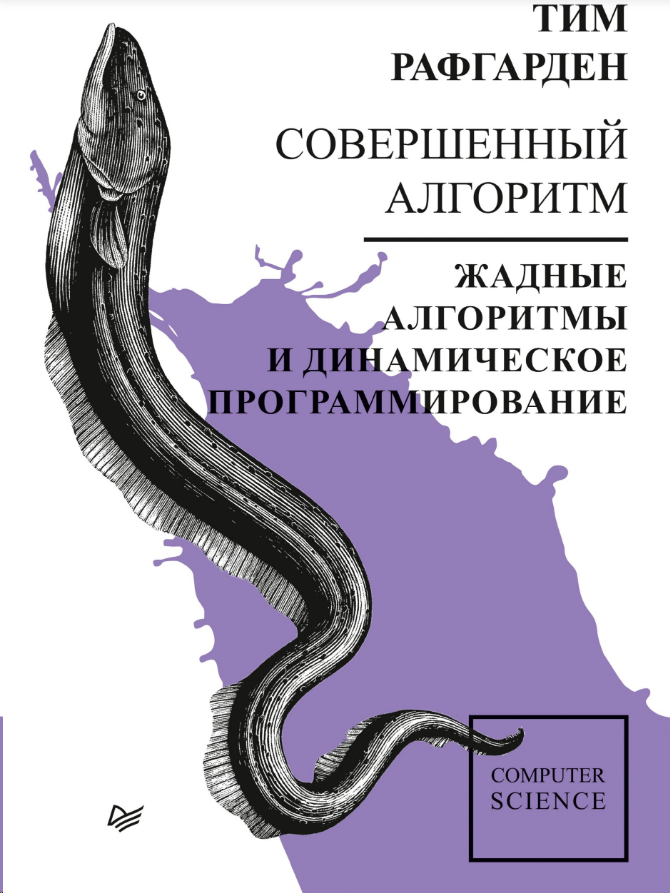
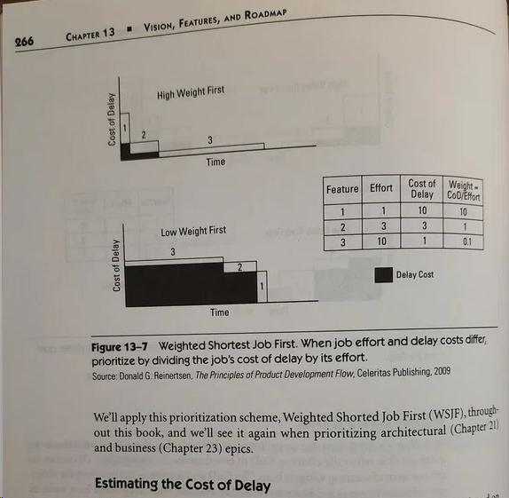
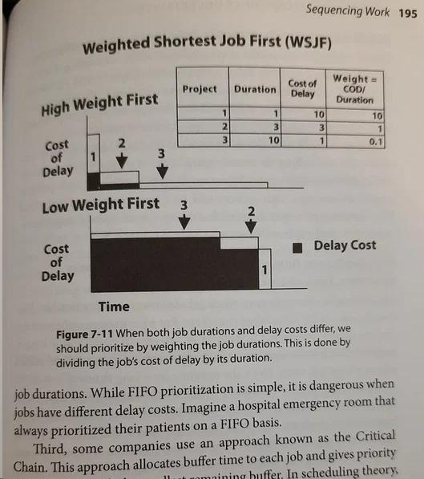
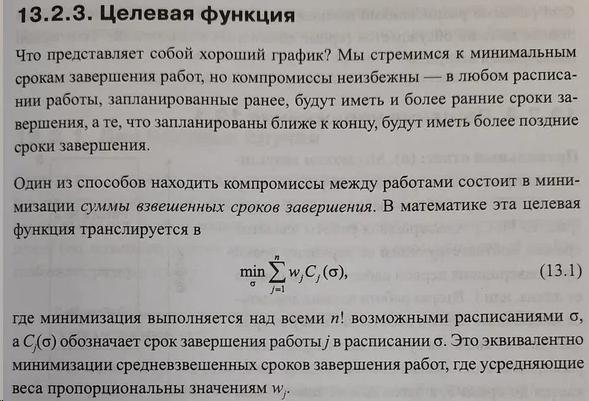
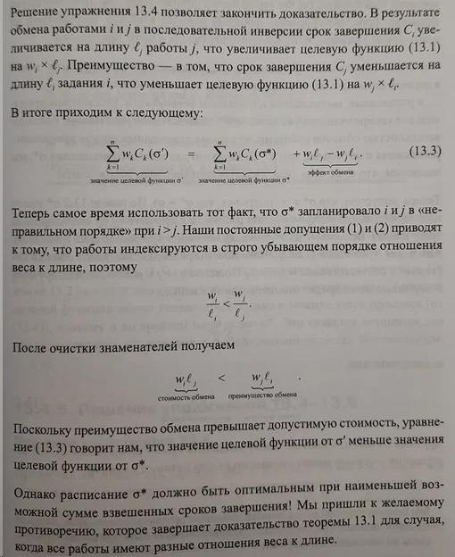
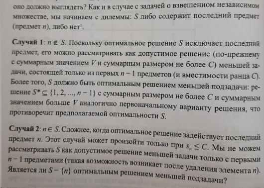

= Совершенный алгоритм. Жадные алгоритмы и динамическое программирование

_2022-06-30_

_Совершенный алгоритм. Жадные алгоритмы и динамическое программирование_ - это link:https://www.piter.com/collection/programmirovanie-osnovy-i-algoritmy/product/sovershennyy-algoritm-zhadnye-algoritmy-i-dinamicheskoe-programmirovanie[третья] часть link:https://www.piter.com/collection/sovershennyy-algoritm[лекций] от Тима Рафгардена. Стиль первых частей сохранён: тем и алгоритмов не много, но разобраны они детально и даны не просто готовыми, но автор показывает, как к ним можно было бы прийти.

Первое, что удивило так это неожиданная встреча с WSJF - weighted shortest job first. WSJF - это популярная методика приоритизации задач в Scrum и Kanban. Например, Дин Леффингуэлл в своём руководстве по SAFe (link:https://www.amazon.com/Agile-Software-Requirements-Enterprise-Development/dp/0321635841[Agile Software Requirements: Lean Requirements Practices for Teams, Programs, and the Enterprise]) *на пальцах* иллюстрирует результаты нескольких вариантов порядка выполнения задач (распределение эпиков, функциональностей и историй по инкрементам, итерациям и спринтам):

В более ранней работе Дональда Рейнертсена link:https://www.amazon.com/gp/product/1935401009[The Principles of Product Development Flow: Second Generation Lean Product Development] хоть и рассмотрено большее количество примеров и их последствий, но аргументация основана на *контрпримерах*:

Тим Рафгарден в третьей части _Совершенного алгоритма_ не упоминает ни lean, ни agile, ни WSJF. Вместо этого он проводит анализ задачи:

Далее автор строит пару алгоритмов планирования, используя жадный подход, иллюстрирует процесс выбора и *доказывает* оптимальность (с точки зрения целевой функции) расписания, построенного *алгоритмом*:

Удивительно, но работая по Scrum с 2007 года, я и не подозревал о чётких математических основах принципа WSJF и неявном применении жадного алгоритма при планировании спринтов.

В книге Анджела Леонарда link:https://habr.com/ru/post/670218/[Java. Решение практических задач] присутствует описание структуры Union Find (несвязное/непересекающееся/дизъюнктивное множество). Приводится и реализация, и иллюстрации того, как она работает. Но остается главный вопрос: *а зачем это вообще надо???* По сути, все это классифицируется как малополезная информация, что препятствует и усвоению, и запоминанию, а главное применению. В _Совершенном алгоритме_ подход совершенно иной:

. Стоит задача оптимально соединить некоторые элементы.
. Решаем её с помощью минимального остовного дерева.
. Для его поиска применяем алгоритм Краскала (здесь перевели именно так).
. В этом алгоритме есть две главные и самые частые операции:
.. Для того чтобы не получился цикл, проверить не принадлежат ли уже обе вершины ребра какому-либо из подграфов (поиском в графе или проверкой принадлежности вершины множеству).
.. Для того чтобы вырастить минимальное остовное дерево, соединить два подграфа, когда вершины очередного ребра лежат в каждом из них (например, выполнить операцию объединения двух подмножеств, содержащих вершины).
. Стандартные (в глубину и ширину) решения для поиска в графе (для установления факта принадлежности ему вершины) и стандартные реализации множеств на основе деревьев и хеш-таблиц слишком неэффективны (например, операция объединения множеств; плюс нужное подмножество ещё нужно найти). Требуется альтернативное решение, оптимизированное для операций поиска подмножества, содержащего заданный элемент, и объединения подмножеств.
. Вот теперь уже и появляется Union Find с описанием, кодом, иллюстрациями и анализом времени выполнения.

При подобном подходе, используемом Тимом Рафгарденом в книге _Совершенный алгоритм_, не возникает ощущения недосказонности и сомнений в надобности всех этих ухищрений.

Больше половины книги отведено под динамическое программирование. И дело здесь не в трёх десятках приведённых алгоритмов. Наоборот, из большого числа классических задач, решаемых динамическим программированием, здесь приведено всего 6. Но каждая из них рассмотрена детально. И, самое главное, рассматривается не просто готовое решение, а его поиск. При этом используется очень интересный подход.

В большинстве источников описывается то, что мы от меньшей задачи переходим к большей, и требуется найти формулу вычисления следующего шага из предыдущего. Как именно это делается, часто опускается или иллюстрируется примерами. Александр Шень в книге link:https://habr.com/ru/post/667022/[Программирование: теоремы и задачи] приводит более формализованный подход с использованием индуктивных расширений функций. Однако, как получить индуктивное расширение не всегда очевидно.

Тим Рафгарден в своей книге _Совершенный алгоритм_ описывает и многократно иллюстрирует иной подход к поиску формулы. Он начинает с итогового значения для финальной самой большой задачи. Далее он анализирует каким образом мы могли к этому значению прийти: какие в принципе существуют варианты того, как мы могли сюда попасть; чем определялось, какой именно из вариантов был использован. Это помогает найти рекурсивную формулу, которую остаётся эффективно вычислить табличным способом. Решение получается несколько задом наперёд, но при этом формула не просто берётся с потолка, а выводится.

Немного портит впечатление лишь работа переводчика, когда _связные графы_ вдруг превращаются в _замкнутые графики_, а потом обратно. Но общую оценку это не меняет.

С полным оглавление можно ознакомиться на сайте издательства: link:https://www.piter.com/collection/programmirovanie-osnovy-i-algoritmy/product/sovershennyy-algoritm-zhadnye-algoritmy-i-dinamicheskoe-programmirovanie#Oglavlenie-1[здесь].
