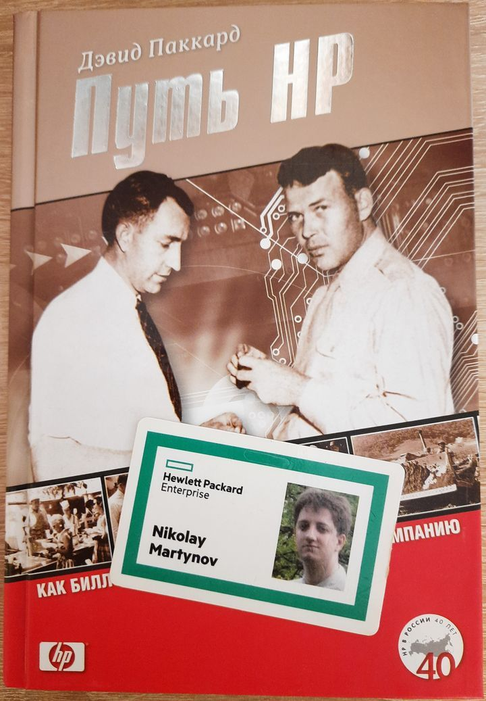

= Хьюлетт Паккард

_2022-07-04_

Ну вот и закончилась целая эпоха - более 13 лет работы в Хьюлетт Паккард. Да, компания уходит с российского рынка, но я не буду её упрекать. И причина не в том, что она так долго держалась. Дело даже не в достойной компенсации рисков, связанных с потерей работы. Дело скорее во всех тех причинах, почему я здесь работал более 13 лет.

В далёком 2009 году меня поразили две вещи:

. Глубина технических познаний человека, проводившего собеседование. Нечасто встречаешь людей, которые читали link:https://docs.oracle.com/javase/specs/jvms/se18/html/index.html[JLS], https://docs.oracle.com/javase/specs/jvms/se18/html/index.html[JVMS], знают про изменение порядка исполнения и link:https://docs.oracle.com/javase/specs/jls/se18/html/jls-17.html#d5e38261[happens-before]. При этом, я не встретил заносчивости и высокомерия, на меня не смотрели как на пришедшего за милостыней.
. Время и усилия, потраченные руководителем отдела. Почти час я аргументировал, почему в итоге выбрал вакансию в другой компании. И каждый раз он находил убедительные контраргументы и причины, почему я должен работать именно в Хьюлетт Паккард.

Я понял, что хочу работать с этими *Профессионалами*. Чёрт с ней с зарплатой и потенциальными перспективами переезда. Мне хотелось работать с этими людьми, в их команде, учиться у них. Мне хотелось работать в компании, где такое отношение к людям.

Конечно, такая огромная компания, как Хьюлетт Паккард (до разделения было более 300 тысяч сотрудников), имеет свои особенности, связанные с историческим багажом. Одно дело стартап с чистого листа и совсем другое, когда у тебя возраст продуктов больше, чем возраст сотрудников. Но, так как в HP важен результат, такие нововведения (спасибо link:https://bftcom.com/[БФТ]!) как link:https://agilemanifesto.org/iso/ru/manifesto.html[Agile], link:https://scrumguides.org/scrum-guide.html[Scrum], link:https://lean.cdto.ranepa.ru/2-2-lean-i-razvitie-koncepcii-berezhlivogo-upravleniya[Lean], link:https://trends.rbc.ru/trends/education/603c9ec19a794750e347e6bc[Kanban], link:https://martinfowler.com/articles/continuousIntegration.html[CI], полное автоматическое link:http://www.protesting.ru/testing/levels/system.html[системное тестирование] всё же смогли получить шанс и занять своё достойное место.

С другой стороны, когда продукты должны жить годами; когда клиенты должны приходить за новыми версиями; когда всё ещё на поддержке версия, в разработке, которой участвовали сотрудники, которые давно уже ушли - всё это особый мир, не сравнимый с проектной работой. Многие скажут "legacy", а я отвечу, что могут и умеют далеко не все. Хьюлетт Паккард мне такой опыт дал, а то, что будет как на прогулке - ну так этого никто и не обещал.

Многого стоит опыт работы и общения с коллегами, партнёрами и клиентами в Индии, США, Китае, Франции, Польше, Канаде, Турции, Японии. Бесценным был и опыт командировок во Францию и США. Посмотреть как работают другие западные компании, что у них также, а что по-другому, сравнить корпоративную культуру. А ещё стал понятен правильный ответ на предложения о переезде.

Профессионалы и ценности (не путать с новомодными веяниями: отношение к сотрудникам, корпоративная культура, фокус на результате и отношении клиентов). Вот чем мне запомнится Хьюлетт Паккард.
