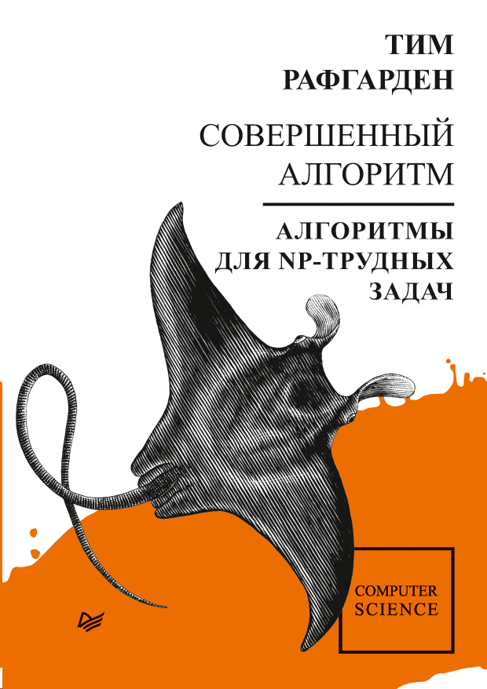

= Совершенный алгоритм. Алгоритмы для NP-трудных задач

_2022-07-13_

_Совершенный алгоритм. Алгоритмы для NP-трудных задач_ - link:https://www.piter.com/collection/sovershennyy-algoritm/product/sovershennyy-algoritm-algoritmy-dlya-np-trudnyh-zadach[четвертая] и заключительная часть link:https://www.piter.com/collection/sovershennyy-algoritm[лекций] от Тима Рафгардена.

Для NP-трудных задач мы снова имеем треугольник, в котором для решения предлагается выбрать две характеристики из трех:

* Универсальность
* Правильность (точность)
* Скорость

*Компромисс по универсальности* рассмотрен вскользь на примере задач о рюкзаке и взвешенном независимом множестве (максимизация суммы весов несмежных вершин). Хотелось бы больше примеров на эту тему ведь данный подход может дать наилучший результат. Тут и там можно встретить дополнительные примеры частных случаев, но какая-либо систематизация по данной теме не приводится.

*Неточные алгоритмы* - самые многочисленные из рассмотренных в книге:

* Алгоритмы Грэма и LPT (Longest Processing Time First) - жадные алгоритмы назначения заданий (минимизация производственной продолжительности)
* Жадный алгоритм максимизации охвата элементов заданными подмножествами
* Жадный алгоритм максимизации влияния (активация максимального числа вершин графа через заданный бюджет затравочных вершин)
* Эвристический алгоритм ближайшего соседа для задачи коммивояжёра и улучшение тура двукратной заменой и локальным поиском

*Небыстрых алгоритмов* в книге рассмотрено еще меньше:

* Алгоритм Беллмана-Хелда-Карпа для поиска тура с минимальной суммой рёберных стоимостей
* Раскраска графа и использование панхроматических путей в задаче поиска самого дешёвого k-вершинного пути
* Использование дискретных оптимизаторов MIP (Mixed Integer Programming) и решателей выполнимости булевых формул SAT (SATisfiability)

Как видно, собственно алгоритмов в книге представлено немного. При этом, 4-я часть самая большая по количеству страниц (304) в данной серии. Нельзя сказать, что каждый алгоритм прям разжёван до полной усвояемости. Частенько приходится посидеть с карандашом и бумагой, чтобы разобраться откуда что взялось и почему. Тем не менее, следуя стилям предыдущих трёх частей, автор старается объяснить каждую задачу, идею решения, разбирает примеры, приводит алгоритм и анализирует его характеристики. Это не каталог алгоритмов. Это лекции. И в четвёртой части лекций об алгоритмах теория занимает центральное место. И, как замечает сам автор, это лишь введение в NP-трудные задачи. Я бы сказал, что даже не вершина айсберга (автор приводит массу ссылок на дополнительную информацию по рассматриваемым темам). Возможно, вся эта теория - и не самая ценная информация для практика, который ждёт каталога готовых решений. Однако, без неё может быть сложно не только понять готовый алгоритм, но и вовсе сориентироваться в массе доступного инструментария.

Разбавляет всю эту теорию разбор примера перераспределения спектра радиочастот в США - реальная большая задача с массой особенностей. Для её решения была применена широкая номенклатура из того, что описано в книге. Подобный наглядный пример хорошо иллюстрирует введение в теорию NP-трудных задач.

Не могу сказать, что завершающая часть - лёгкое завлекающее чтиво. Приходится и вчитываться, и перечитывать, и математики хватает. Но, если у вас не было соответствующего курса в университете, то "_Совершенный алгоритм. Алгоритмы для NP-трудных задач_" - неплохая замена для старта в данной области. Считаю, что хорошо подойдёт и студентам ввиду детального разбора основ.

С полным оглавлением можно ознакомиться на сайте издательства: link:https://www.piter.com/collection/sovershennyy-algoritm/product/sovershennyy-algoritm-algoritmy-dlya-np-trudnyh-zadach#Oglavlenie-1[здесь].
